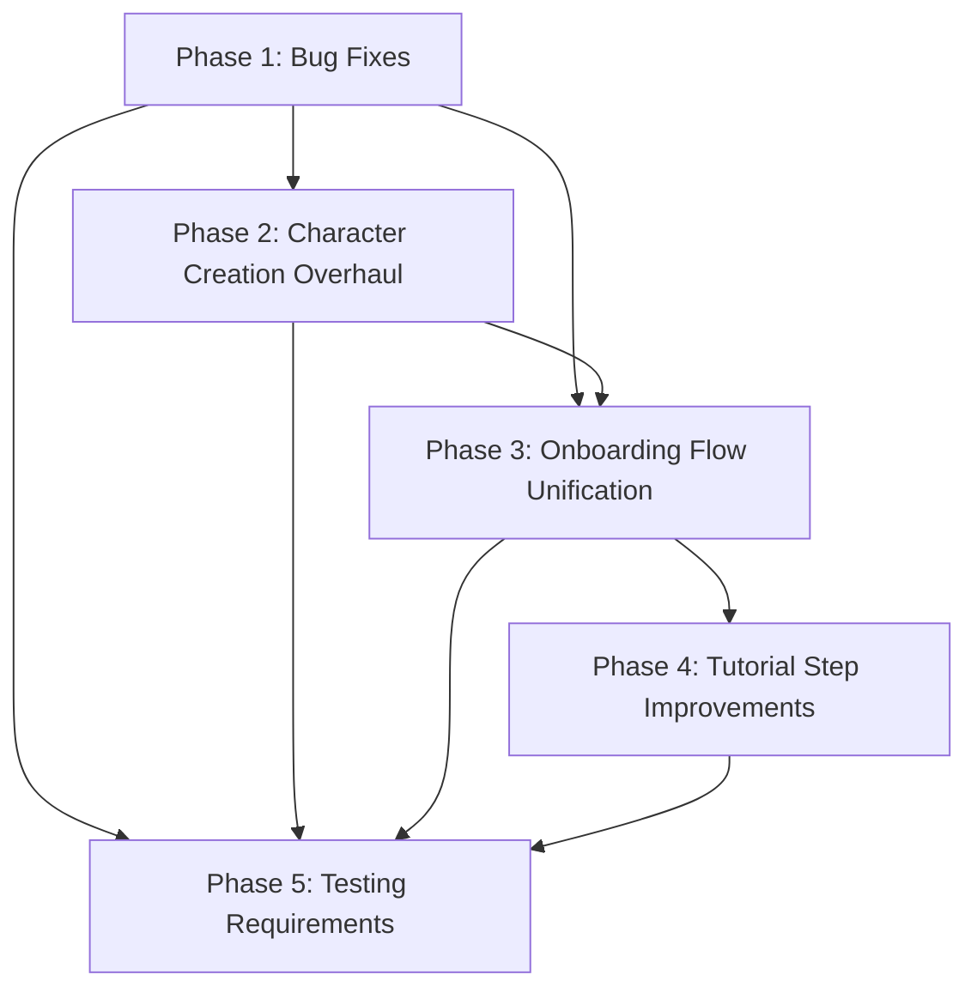

# Tutorial & Onboarding Overhaul — Implementation Plan

This plan describes a phased approach to fixing, expanding, and unifying the three tutorial layers in Venture — `CharacterCreationTutorial`, `EbitenTutorialSystem`, and the context-sensitive `TutorialManager` — along with expanding the character creation class/equipment selection from 3 classes to all 6 base classes (with hybrid visibility), and wiring the `ShowTutorials` setting into all layers. Each task is a discrete checkbox item with file path, description, and acceptance criteria.

---

## Dependency Diagram

Phases 1 and 2 can proceed in parallel. Phase 3 depends on both. Phase 4 depends on Phase 3. Phase 5 runs incrementally after each phase.

---

## Phase 1 — Bug Fixes

### 1.1 Wrong Dimensions in `NewTutorialSystem()` (S)

- **File**: `pkg/engine/tutorial_system.go:48`
- **Root cause**: `NewTutorialSystem()` calls `NewTutorialSystemWithSize(800, 600)` with hardcoded defaults. The caller in `cmd/client/handlers.go:2802` invokes `engine.NewTutorialSystem()` without passing actual screen dimensions. Touch button positions (Next at `screenWidth-164`, Skip at `44`) are computed from these wrong values and never update if the window resizes.
- **Fix**:
  1. Change `initializeTutorialAndHelp()` in `cmd/client/handlers.go:2801` to pass actual screen dimensions (from the `*width` and `*height` CLI flags or `ebiten.WindowSize()`) to `engine.NewTutorialSystemWithSize()`.
  2. Add a `Resize(screenWidth, screenHeight int)` method to `EbitenTutorialSystem` that recalculates `ts.screenWidth`, `ts.screenHeight`, and repositions `nextButton` and `skipButton`.
  3. Call `Resize()` at the start of `Draw()` using `screen.Bounds().Dx()` / `Dy()` so the panel and buttons always match the actual screen.
- **Acceptance**: Tutorial panel and touch buttons render correctly on 1920×1080, 1280×720, and 800×600 resolutions. No hardcoded 800/600 remains in `NewTutorialSystem()`.

- [x] Pass actual screen size to `NewTutorialSystemWithSize()` in `cmd/client/handlers.go`
- [x] Add `Resize()` method to `EbitenTutorialSystem` in `pkg/engine/tutorial_system.go`
- [x] Call `Resize()` from `Draw()` using actual screen bounds

### 1.2 Step Skipping — Exploration Always True (S)

- **File**: `pkg/engine/tutorial_system.go:260`
- **Root cause**: `checkExplorationCondition()` unconditionally returns `true`, causing the final "Dungeon Exploration" step to complete the instant the previous step finishes.
- **Fix**: Replace the body with a meaningful condition — e.g., check that the player has visited at least 3 distinct tile regions (using spatial partition cell IDs) or has moved a total distance of ≥500 units from their starting position. Track cumulative distance in a tutorial-local variable (not a component) by summing position deltas across `Update` calls.
- **Acceptance**: The exploration step does not auto-complete. The player must actually explore before the tutorial finishes.

- [ ] Implement real exploration condition in `checkExplorationCondition()` at `pkg/engine/tutorial_system.go:260`

### 1.3 Step Skipping — Combat Condition OR Bug (S)

- **File**: `pkg/engine/tutorial_system.go:203-206`
- **Root cause**: `checkCombatCondition()` returns `attack.CooldownTimer > 0 || attack.CooldownTimer < attack.Cooldown`. When `Cooldown` is positive (the common case), `CooldownTimer` starts at 0 which is `< Cooldown`, making the right side of the OR always true. The condition passes before any attack occurs.
- **Fix**: Change to `attack.CooldownTimer > 0 && attack.CooldownTimer < attack.Cooldown` (AND), or better: add a `TotalAttacks int` field to `AttackComponent` and check `attack.TotalAttacks > 0`. Since adding a field to a component is a data change, the simpler AND fix is preferred for Phase 1; a richer condition can follow in Phase 4.
- **Acceptance**: Combat tutorial step only completes after the player has actually attacked (cooldown timer entered active state).

- [x] Fix OR→AND logic in `checkCombatCondition()` at `pkg/engine/tutorial_system.go:203-206`

### 1.4 Step Skipping — Hardcoded Spawn Position (S)

- **File**: `pkg/engine/tutorial_system.go:188`
- **Root cause**: `checkMovementCondition()` computes distance from `(400, 300)` which is only correct at 800×600. On other resolutions the actual spawn point differs, so the distance check may instantly pass or never pass.
- **Fix**: Record the player's initial position on the first call to `checkMovementCondition()` (store in a package-level or struct-level variable keyed by entity ID) and measure distance from that recorded origin instead of `(400, 300)`.
- **Acceptance**: Movement step works correctly regardless of screen size or spawn location.

- [ ] Remove hardcoded `(400, 300)` in `checkMovementCondition()` at `pkg/engine/tutorial_system.go:188`
- [ ] Record initial player position on first condition check

### 1.5 ESC Hint Misleading (S)

- **File**: `pkg/engine/tutorial_system.go:642` (hint text) vs `:295-298` (ESC handler)
- **Root cause**: The panel draws "Press ESC to skip current step" (line 642), but pressing ESC calls `HideTutorialUI()` which hides the overlay without advancing the step. The user expects ESC to advance; instead it hides.
- **Fix**: Change the hint text at line 642 from `"Press ESC to skip current step"` to `"Press ESC to minimize tutorial"` to match actual behavior. Alternatively, add a separate key hint for advancing (e.g., "Press N for next step"). The text-change approach is simplest and least risky.
- **Acceptance**: Hint text accurately describes ESC behavior. No user confusion about ESC skipping vs. hiding.

- [x] Update hint text in `drawPanelContent()` at `pkg/engine/tutorial_system.go:642`

### 1.6 Class Selection Limited to 3/21 (M)

- **Files**:
  - `pkg/engine/character_creation.go:703-728` — `handleArrowKeySelection()` wraps between `ClassWarrior` and `ClassRogue`
  - `pkg/engine/character_creation.go:730-740` — `handleNumberKeySelection()` only maps keys 1-3
  - `pkg/engine/character_creation.go:743-757` — `handleTouchOrMouseClick()` only iterates `{ClassWarrior, ClassMage, ClassRogue}`
  - `pkg/engine/character_creation.go:762-771` — `handleTouchOrMouseHover()` same 3-class array
  - `pkg/engine/character_creation.go:1375` — `drawClassSelection()` draws only 3 classes
- **Root cause**: Every input handler and draw method uses a hardcoded `[]CharacterClass{ClassWarrior, ClassMage, ClassRogue}` slice.
- **Fix**: Detailed in Phase 2 (Section 2.1). This bug entry documents the scope; the actual fix is in Phase 2.
- **Acceptance**: All 6 base classes are selectable via arrow keys, number keys, touch, and mouse.

- [ ] Expand class arrays in all 5 locations (deferred to Phase 2, task 2.1)

### 1.7 `Validate()` Rejects Valid Classes (S)

- **File**: `pkg/engine/character_creation.go:285`
- **Root cause**: `CharacterData.Validate()` checks `cd.Class > ClassNecromancer` and returns error, blocking all 15 hybrid classes (Battlemage through Ninja, values 6-20).
- **Fix**: Change the upper bound to `ClassNinja` (the last defined class constant). Update to: `if cd.Class < ClassWarrior || cd.Class > ClassNinja`.
- **Acceptance**: `Validate()` accepts all 21 defined classes. Existing tests updated to cover hybrid class validation.

- [x] Change `ClassNecromancer` to `ClassNinja` in `Validate()` at `pkg/engine/character_creation.go:285`

### 1.8 Non-Deterministic Name Generation (S)

- **File**: `pkg/engine/character_creation.go:1029`
- **Root cause**: `generateRandomName()` uses `len(cc.nameInput) % len(prefixes)` for prefix selection and `cc.selectedClass % len(suffixes)` for suffix. This is not seeded randomness — it depends on typing state, violating project determinism requirements. Two players with different name input lengths get different "random" names non-reproducibly.
- **Fix**: Accept a seed parameter (or use the world seed stored in defaults) and generate via `rand.New(rand.NewSource(seed))`. Example: `rng := rand.New(rand.NewSource(seed)); prefix := prefixes[rng.Intn(len(prefixes))]`.
- **Acceptance**: Same seed always produces same name. No `time.Now()` or global `rand` usage.

- [x] Refactor `generateRandomName()` to use seed-based RNG at `pkg/engine/character_creation.go:1029`

### 1.9 `ImportState` Clamp Bug (S)

- **File**: `pkg/engine/tutorial_system.go:477-483`
- **Root cause**: When a completed tutorial is loaded (`currentStepIdx == len(Steps)`), the clamp `if ts.CurrentStepIdx >= len(ts.Steps) { ts.CurrentStepIdx = len(ts.Steps) - 1 }` pushes the index back to the last step, potentially re-showing a finished tutorial since `Enabled` may still be true from the loaded state.
- **Fix**: Add a guard: if all steps are marked completed in `completedSteps`, set `ts.Enabled = false` and keep `ts.CurrentStepIdx = len(ts.Steps)` (don't clamp it down). Only clamp when not all steps are complete.
- **Acceptance**: Loading a save with completed tutorial does not re-display tutorial UI. `ImportState` round-trips correctly with `ExportState`.

- [ ] Fix clamp logic in `ImportState()` at `pkg/engine/tutorial_system.go:477-483`

### 1.10 `ShowTutorials` Setting Unwired (M)

- **File**: `pkg/engine/settings.go:31` (definition), `pkg/engine/settings_ui.go:26,311-312,350-351,369-370,494-495` (UI toggle), `cmd/client/handlers.go:2802-2804` (only `noTutorial` flag checked)
- **Root cause**: The `GameSettings.ShowTutorials` field is toggled in the settings UI but never read by `initializeTutorialAndHelp()` or any tutorial system. Only the `--no-tutorial` CLI flag disables tutorials.
- **Fix**: In `initializeTutorialAndHelp()` (or its caller), load `GameSettings` and check `settings.ShowTutorials`. If false, disable all three tutorial layers. This requires passing the settings instance (or the `ShowTutorials` bool) into the function. Full wiring is in Phase 3, task 3.3; Phase 1 documents the bug.
- **Acceptance**: Toggling "Show Tutorials" in settings and restarting correctly enables/disables all tutorials.

- [ ] Wire `ShowTutorials` into tutorial initialization (deferred to Phase 3, task 3.3)

---

## Phase 2 — Character Creation Overhaul

### 2.1 Expand Class Selection UI to 6 Base Classes (M)

- **File**: `pkg/engine/character_creation.go`
- **Description**: Replace every hardcoded `[]CharacterClass{ClassWarrior, ClassMage, ClassRogue}` with a shared constant or variable containing all 6 base classes: `{ClassWarrior, ClassMage, ClassRogue, ClassRanger, ClassCleric, ClassNecromancer}`.
- **Locations to modify**:
  - `handleArrowKeySelection()` (line ~703): wrap range `ClassWarrior..ClassNecromancer`
  - `handleNumberKeySelection()` (line ~730): add keys 4-6 for Ranger, Cleric, Necromancer
  - `handleTouchOrMouseClick()` (line ~743): iterate 6-class slice
  - `handleTouchOrMouseHover()` (line ~762): iterate 6-class slice
  - `drawClassSelection()` (line ~1375): draw 6 class boxes (adjust spacing: reduce per-class height from 80px to ~55px, or add scrolling if panel height is insufficient)
  - Help text at line ~1404: change "1-3" to "1-6"
- **Acceptance**: All 6 base classes visible and selectable. Arrow keys wrap through all 6. Number keys 1-6 select directly. Touch/click works for all 6.

- [ ] Define `baseClasses` variable with 6 classes
- [ ] Update `handleArrowKeySelection()` wrap bounds
- [ ] Update `handleNumberKeySelection()` with keys 4-6
- [ ] Update `handleTouchOrMouseClick()` with 6-class slice
- [ ] Update `handleTouchOrMouseHover()` with 6-class slice
- [ ] Update `drawClassSelection()` layout for 6 classes
- [ ] Update help text strings

### 2.2 Add Hybrid Class Visibility (Paginated/Scrollable) (L)

- **File**: `pkg/engine/character_creation.go`
- **Description**: Add a "Show Advanced Classes" toggle or a second page/tab in class selection that reveals the 15 hybrid classes. Use page-up/page-down or a tab key to switch between base and hybrid views. Each page shows up to 6 classes at a time.
- **Implementation**:
  - Add `classPage int` field to `EbitenCharacterCreation` (0 = base, 1+ = hybrid pages)
  - Add page navigation keys (PageUp/PageDown or Tab)
  - Draw page indicator ("Page 1/4" etc.)
  - Touch buttons for page navigation on mobile
- **Acceptance**: All 21 classes reachable through pagination. Page indicator visible. Touch-friendly navigation.

- [ ] Add `classPage` field and page navigation logic
- [ ] Draw paginated class list with page indicators
- [ ] Add touch buttons for page navigation

### 2.3 Implement `ApplyClassStats()` for All 6 Base Classes (M)

- **File**: `pkg/engine/character_creation.go:1891` (`ApplyClassStats`), `:1853-1889` (stat functions)
- **Description**: The `switch` in `ApplyClassStats()` only handles Warrior, Mage, Rogue and falls through to `default: return error`. Add `applyRangerStats()`, `applyClericStats()`, `applyNecromancerStats()` functions and wire them into the switch.
- **Stat design** (balanced around existing values):
  - **Ranger**: HP 110, Mana 70, Attack 11, Defense 4, CritChance 0.12, Evasion 0.10
  - **Cleric**: HP 120, Mana 120, Attack 7, Defense 6, ManaRegen 6.0, CritDamage 1.5
  - **Necromancer**: HP 90, Mana 130, Attack 8, Defense 4, ManaRegen 5.0, CritChance 0.08
- **Acceptance**: `ApplyClassStats()` succeeds for all 6 base classes. Stats match design spec. Unit tests validate each class.

- [ ] Add `applyRangerStats()`, `applyClericStats()`, `applyNecromancerStats()` functions
- [ ] Add cases to `ApplyClassStats()` switch for Ranger, Cleric, Necromancer
- [ ] Consider stub/fallback stats for hybrid classes (can return base-class-average stats with a log warning for now)

### 2.4 Implement `getClassStats()` for All 6 Base Classes (S)

- **File**: `pkg/engine/character_creation.go:1662` (`getClassStats`)
- **Description**: The confirmation screen's stat preview only works for 3 classes. Add cases for Ranger, Cleric, Necromancer to return human-readable stat strings matching the values from task 2.3.
- **Acceptance**: Confirmation screen shows correct stats for all 6 base classes. No empty stats array for Ranger/Cleric/Necromancer.

- [ ] Add Ranger, Cleric, Necromancer cases to `getClassStats()`

### 2.5 Add Starting Equipment Selection Step (L)

- **File**: `pkg/engine/character_creation.go`
- **Description**: Insert a new `stepEquipmentSelection` between `stepClassSelection` and `stepPortraitSelection`. The step shows 2-3 equipment loadout options per class, generated deterministically from the world seed.
- **Implementation**:
  1. Add `stepEquipmentSelection` constant to `creationStep` enum (shift `stepPortraitSelection` and `stepConfirmation` values)
  2. Add `selectedLoadout int` and `equipmentOptions []EquipmentLoadout` fields to `EbitenCharacterCreation`
  3. Define `EquipmentLoadout` struct: `{Name string, Description string, Items map[EquipmentSlot]*item.Item}`
  4. Add `generateClassLoadouts(class CharacterClass, seed int64) []EquipmentLoadout` using `rand.New(rand.NewSource(seed))` — produces 3 loadouts per class (e.g., Warrior: "Heavy Armor", "Balanced", "Berserker")
  5. Use `EquipmentComponent` from `pkg/engine/inventory_components.go:180` (9 slots: MainHand, OffHand, Head, Chest, Legs, Boots, Gloves, Accessory1-3)
  6. Add `updateEquipmentSelection()` and `drawEquipmentSelection()` methods
  7. Update step indicator from "4 steps" to "5 steps" across all draw methods
  8. Update all navigation handlers (`handleNextButton`, `handleBackButton`, step transitions) to include the new step
- **Acceptance**: Equipment step appears between class and portrait. Each class shows 3 distinct loadout options. Loadouts are deterministic (same seed = same options). Selected equipment is applied to `CharacterData` and carried to gameplay.

- [ ] Add `stepEquipmentSelection` to `creationStep` enum
- [ ] Define `EquipmentLoadout` struct
- [ ] Implement `generateClassLoadouts()` with seed-based RNG
- [ ] Add `updateEquipmentSelection()` input handler
- [ ] Add `drawEquipmentSelection()` renderer
- [ ] Update step count in all step indicator text ("Step N of 5")
- [ ] Update navigation handlers for new step ordering
- [ ] Wire selected equipment into player entity creation in `cmd/client/handlers.go`

### 2.6 Update Character Creation Tutorial Steps (S)

- **File**: `pkg/engine/character_creation_tutorial.go:63-100`
- **Description**: The `CharacterCreationTutorial` defines 5 steps (welcome, name, class, portrait, confirmation) that map to the 4 creation steps. With the new equipment step, add a 6th tutorial step "Choose Your Equipment" after the class selection tutorial step.
- **Acceptance**: Tutorial step count matches creation step count. Equipment tutorial step provides relevant guidance text.

- [ ] Add equipment tutorial step to `createCharacterCreationTutorialSteps()`
- [ ] Update `synchronizeTutorialProgress()` mapping if needed

---

## Phase 3 — Onboarding Flow Unification

### 3.1 Define Overall Onboarding Flow (S)

- **File**: New section in `pkg/engine/tutorial_system.go` or new file `pkg/engine/onboarding.go`
- **Description**: Define the canonical onboarding sequence as a state machine:
  1. Character Creation Tutorial (`CharacterCreationTutorial`) overlays character creation UI
  2. Character creation completes → player entity spawned with class/equipment
  3. In-Game Tutorial (`EbitenTutorialSystem`) activates automatically
  4. Context-Sensitive Help (`TutorialManager` from `pkg/rendering/ui/tutorial.go`) activates on first encounter with each game system
- **Implementation**: Create an `OnboardingState` enum (`StateCharacterCreation`, `StateInGameTutorial`, `StateContextHelp`, `StateComplete`) and an `OnboardingManager` struct that tracks the current state and coordinates transitions.
- **Acceptance**: Clear state machine definition. Transitions are triggered by completion callbacks, not polling.

- [ ] Define `OnboardingState` enum and `OnboardingManager` struct
- [ ] Implement state transition logic with completion callbacks

### 3.2 Connect Character Creation Completion to In-Game Tutorial (M)

- **File**: `cmd/client/handlers.go` (where character creation completes and game state transitions)
- **Description**: Currently, `CharacterCreationTutorial` completion and `EbitenTutorialSystem` activation are independent. After character creation finishes (confirmed or skipped), the `OnboardingManager` should transition to the in-game tutorial state and activate `EbitenTutorialSystem`.
- **Implementation**:
  1. After `EbitenCharacterCreation.IsComplete()` returns true in the client game loop, call `OnboardingManager.TransitionToInGameTutorial()`
  2. This activates `EbitenTutorialSystem.Enabled = true` and `ShowUI = true`
  3. If the creation tutorial was skipped, still show the in-game tutorial (separate skip decisions)
  4. Store onboarding state in the `TutorialCompletionComponent` for save/load
- **Acceptance**: Completing character creation seamlessly transitions to in-game tutorial. No manual activation needed. Save/load preserves onboarding state.

- [ ] Add transition call after character creation completion in client handlers
- [ ] Update `TutorialCompletionComponent` to track onboarding state

### 3.3 Wire `ShowTutorials` Setting to All Three Layers (M)

- **Files**: `cmd/client/handlers.go`, `pkg/engine/tutorial_system.go`, `pkg/engine/character_creation_tutorial.go`, `pkg/rendering/ui/tutorial.go`
- **Description**: The `GameSettings.ShowTutorials` field (settings.go:31) is toggled in settings UI but never read by any tutorial system. The `--no-tutorial` CLI flag only disables the in-game tutorial.
- **Implementation**:
  1. In `initializeTutorialAndHelp()` at `cmd/client/handlers.go:2801`, load game settings and check `ShowTutorials`
  2. If `ShowTutorials == false` OR `*noTutorial == true`, disable all three systems:
     - `EbitenTutorialSystem`: `Enabled = false, ShowUI = false`
     - `CharacterCreationTutorial`: `Enabled = false`
     - `TutorialManager`: call `Disable()`
  3. Pass the setting through to the `OnboardingManager` so it can skip the entire onboarding flow
  4. When user toggles `ShowTutorials` in settings UI at runtime, propagate to active tutorial systems
- **Acceptance**: Setting "Show Tutorials = OFF" disables character creation tutorial, in-game tutorial, and contextual help. `--no-tutorial` flag has the same effect. Both are consistent.

- [ ] Read `ShowTutorials` from `GameSettings` in `initializeTutorialAndHelp()`
- [ ] Propagate setting to `CharacterCreationTutorial` and `TutorialManager`
- [ ] Support runtime toggle from settings UI

### 3.4 Make In-Game Tutorial Class-Aware (M)

- **File**: `pkg/engine/tutorial_system.go`
- **Description**: The in-game tutorial combat step says "Press SPACE near an enemy to attack" regardless of class. A Mage should see "Press 1-5 to cast spells", a Ranger should see "Click to fire arrows", etc.
- **Implementation**:
  1. Add a `PlayerClass CharacterClass` field to `EbitenTutorialSystem`
  2. Set it after character creation completes (from `OnboardingManager`)
  3. In `createDefaultTutorialSteps()` or at step creation time, use class-specific text templates
  4. Can use a map `CharacterClass → step overrides` for combat, inventory, and skills steps
- **Acceptance**: Combat/skills tutorial text changes based on selected class. Each of the 6 base classes has appropriate hints.

- [ ] Add `PlayerClass` field to `EbitenTutorialSystem`
- [ ] Define class-specific tutorial text overrides
- [ ] Apply overrides in step creation or display logic

---

## Phase 4 — Tutorial Step Improvements

### 4.1 Dynamic Movement Condition (S)

- **File**: `pkg/engine/tutorial_system.go:183-196`
- **Description**: Replace hardcoded `(400, 300)` spawn reference with dynamically recorded initial position (as planned in bug fix 1.4). Additionally, consider tracking actual distance traveled (sum of frame-to-frame deltas) rather than straight-line displacement, to ensure the player has genuinely moved around.
- **Acceptance**: Movement step completes only after the player has moved ≥50 units from their actual spawn point.

- [ ] Implement cumulative distance tracking or displacement from recorded origin

### 4.2 Real Exploration Condition (M)

- **File**: `pkg/engine/tutorial_system.go:260`
- **Description**: Replace `return true` with a condition that verifies the player has explored. Options:
  - Track unique spatial partition cells visited (requires `EbitenTutorialSystem` to hold state)
  - Check that the player has moved through at least 3 rooms/corridors (requires terrain awareness)
  - Simplest: track total distance traveled since tutorial start; require ≥500 units cumulative
- **Implementation**: Add `explorationDistance float64` and `lastPosition *PositionComponent` fields to `EbitenTutorialSystem`. In `Update`, accumulate distance. In `checkExplorationCondition`, check threshold.
- **Acceptance**: Exploration step requires meaningful player movement. Auto-completion eliminated.

- [ ] Add exploration tracking state to `EbitenTutorialSystem`
- [ ] Accumulate exploration distance in `Update()`
- [ ] Check threshold in `checkExplorationCondition()`

### 4.3 Responsive Tutorial UI (M)

- **File**: `pkg/engine/tutorial_system.go`
- **Description**: Make the tutorial panel fully responsive. Currently `calculatePanelLayout()` (line ~588) handles some adaptation but button positions are set once at construction.
- **Implementation**:
  1. In `Draw()`, call `Resize(screen.Bounds().Dx(), screen.Bounds().Dy())` (from task 1.1)
  2. Ensure `Resize` repositions both `nextButton` and `skipButton` based on the new panel layout from `calculatePanelLayout()`
  3. Font scaling: if screen width < 600, use smaller text or abbreviate descriptions
  4. Test on mobile-sized viewports (320×480)
- **Acceptance**: Tutorial panel and buttons are correctly positioned at any resolution from 320×480 to 3840×2160.

- [ ] Implement `Resize()` with button repositioning tied to `calculatePanelLayout()`
- [ ] Test at extreme resolutions

### 4.4 Fix ESC Behavior (S)

- **File**: `pkg/engine/tutorial_system.go:295-298, 642`
- **Description**: Either change ESC to actually skip/advance the current step (matching the old hint text), or leave ESC as "minimize" and update the hint (done in bug fix 1.5). If leaving as minimize, add a separate keyboard shortcut (e.g., `N` key) to advance to the next step, and document it in the panel.
- **Acceptance**: ESC behavior and hint text are consistent. An alternative advance key is available.

- [ ] Add `N` key handler to advance tutorial step
- [ ] Update help text to show both ESC (minimize) and N (next step) shortcuts

### 4.5 Tutorial Save/Load Completed State (M)

- **File**: `pkg/engine/tutorial_system.go:455-490`
- **Description**: Fix `ImportState` to correctly handle completed tutorials (bug 1.9) and extend save/load to cover:
  - `OnboardingManager` state (which phase of onboarding the player is in)
  - `CharacterCreationTutorial` completion/skip status (already has `ExportState`/`ImportState`)
  - `TutorialManager` viewed topics (needs serialization support)
- **Implementation**:
  1. Fix the clamp bug (Phase 1, task 1.9)
  2. Add `ExportState`/`ImportState` to `OnboardingManager`
  3. Add serialization for `TutorialManager` viewed-topic set (map topic→bool)
  4. Integrate all three into the save/load pipeline in `pkg/saveload/`
- **Acceptance**: Full round-trip: save game mid-tutorial → load → resume at exact same tutorial state. Completed tutorials stay completed.

- [ ] Add `ExportState`/`ImportState` to `OnboardingManager`
- [ ] Add serialization to `TutorialManager` for viewed topics
- [ ] Integrate into save/load pipeline

---

## Phase 5 — Testing Requirements

### 5.1 Update `tutorial_system_test.go` (M)

- **File**: `pkg/engine/tutorial_system_test.go`
- **Existing tests**: 21 test functions covering creation, steps, progress, skip, reset, export/import, notifications, update cycle
- **New tests needed**:

- [ ] `TestTutorialSystem_Resize` — verify button positions update after resize
- [ ] `TestCheckMovementCondition_DynamicSpawn` — verify movement check uses recorded spawn, not (400,300)
- [ ] `TestCheckCombatCondition_RequiresAttack` — verify combat condition fails before attack, passes after
- [ ] `TestCheckExplorationCondition_NotAlwaysTrue` — verify exploration requires actual movement
- [ ] `TestImportState_CompletedTutorial` — verify completed tutorial stays completed after import (regression for bug 1.9)
- [ ] `TestTutorialSystem_ClassAwareText` — verify step descriptions change per class

### 5.2 Update `tutorial_system_gaps_test.go` (S)

- **File**: `pkg/engine/tutorial_system_gaps_test.go`
- **Existing tests**: 10 test functions covering GAP-001 through GAP-006 repairs
- **New tests needed**:

- [ ] `TestGAP007_ShowTutorialsSettingWired` — verify `ShowTutorials=false` disables tutorial system
- [ ] `TestGAP008_ESCBehaviorMatchesHint` — verify ESC hides (not skips) and hint text says "minimize"

### 5.3 Update `character_creation_test.go` (M)

- **File**: `pkg/engine/character_creation_test.go`
- **Existing tests**: 20+ test functions covering class strings, validation, creation flow, stats, defaults, portraits
- **New tests needed**:

- [ ] `TestCharacterData_Validate_HybridClasses` — verify all 21 classes pass validation (regression for bug 1.7)
- [ ] `TestApplyClassStats_Ranger` — verify Ranger stat application
- [ ] `TestApplyClassStats_Cleric` — verify Cleric stat application
- [ ] `TestApplyClassStats_Necromancer` — verify Necromancer stat application
- [ ] `TestGetClassStats_AllBaseClasses` — verify stat preview text for all 6 base classes
- [ ] `TestGenerateRandomName_Deterministic` — verify same seed produces same name (regression for bug 1.8)
- [ ] `TestClassSelection_SixClasses` — verify arrow key navigation wraps through 6 classes
- [ ] `TestEquipmentLoadoutGeneration` — verify deterministic loadout generation per class

### 5.4 Update `character_creation_tutorial_test.go` (S)

- **File**: `pkg/engine/character_creation_tutorial_test.go`
- **Existing tests**: 12+ test functions covering creation, steps, progress, skip, export/import, update, completion
- **New tests needed**:

- [ ] `TestCharacterCreationTutorial_EquipmentStep` — verify 6th tutorial step exists and syncs correctly
- [ ] `TestCharacterCreationTutorial_OnboardingTransition` — verify completion triggers onboarding state transition

### 5.5 New Test File: `onboarding_test.go` (M)

- **File**: `pkg/engine/onboarding_test.go` (new)
- **New tests needed**:

- [ ] `TestOnboardingManager_StateTransitions` — verify state machine transitions (creation → in-game → contextual → complete)
- [ ] `TestOnboardingManager_SkipAll` — verify `ShowTutorials=false` skips entire onboarding
- [ ] `TestOnboardingManager_ExportImportState` — verify save/load preserves onboarding state
- [ ] `TestOnboardingManager_ClassPropagation` — verify selected class propagates to in-game tutorial

### 5.6 Coverage Targets

| File | Current Coverage (est.) | Target |
|------|------------------------|--------|
| `tutorial_system.go` | ~70% | ≥75% |
| `character_creation.go` | ~65% | ≥70% |
| `character_creation_tutorial.go` | ~80% | ≥80% |
| `rendering/ui/tutorial.go` | ~60% | ≥65% |
| `onboarding.go` (new) | 0% | ≥65% |

- [ ] Run `go test -cover ./pkg/engine/... -run Tutorial` and verify all files meet targets
- [ ] Run `go test -cover ./pkg/rendering/ui/... -run Tutorial` and verify target met

---

## Complexity Summary

| Task | Complexity | Phase |
|------|-----------|-------|
| 1.1 Wrong dimensions | S | 1 |
| 1.2 Exploration always true | S | 1 |
| 1.3 Combat OR bug | S | 1 |
| 1.4 Hardcoded spawn | S | 1 |
| 1.5 ESC hint text | S | 1 |
| 1.6 Class selection 3/21 | M | 1→2 |
| 1.7 Validate rejects hybrids | S | 1 |
| 1.8 Non-deterministic names | S | 1 |
| 1.9 ImportState clamp | S | 1 |
| 1.10 ShowTutorials unwired | M | 1→3 |
| 2.1 Expand to 6 base classes | M | 2 |
| 2.2 Hybrid class pagination | L | 2 |
| 2.3 ApplyClassStats all 6 | M | 2 |
| 2.4 getClassStats all 6 | S | 2 |
| 2.5 Equipment selection step | L | 2 |
| 2.6 Update creation tutorial steps | S | 2 |
| 3.1 Define onboarding flow | S | 3 |
| 3.2 Connect creation→in-game | M | 3 |
| 3.3 Wire ShowTutorials setting | M | 3 |
| 3.4 Class-aware in-game tutorial | M | 3 |
| 4.1 Dynamic movement condition | S | 4 |
| 4.2 Real exploration condition | M | 4 |
| 4.3 Responsive UI | M | 4 |
| 4.4 Fix ESC behavior | S | 4 |
| 4.5 Tutorial save/load | M | 4 |
| 5.1-5.6 Testing | M | 5 |

**S** = Small (≤1 hour), **M** = Medium (1-4 hours), **L** = Large (4-8 hours)
