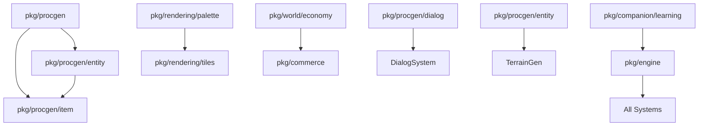

# Integration Audit - December 2025

## Executive Summary

**Date**: December 13, 2025  
**Total Packages**: 103 directories in `pkg/`  
**Active Packages**: 69 (67.0%)  
**Dormant Packages**: 34 (33.0%)  
**Documentation Coverage**: 95/103 packages have `doc.go` (92.2%)

**Core Principle**: All features are baseline features. Every package in `pkg/` exists to provide functionality that should be unconditionally enabled. There are no feature flags, no optional toggles. Integration means direct registration and initialization at startup.

---

## Active Packages (Currently Integrated)

These 69 packages are actively imported and used by `cmd/client/` and/or `cmd/server/`:

### Core Engine (11 packages)
| Package | Used By | Purpose | Systems Registered |
|---------|---------|---------|-------------------|
| `pkg/engine` | client, server | Core ECS framework | 40+ systems (see below) |
| `pkg/engine/physics/destruction` | client | Destructible objects & terrain | DestructionSystem |
| `pkg/engine/physics/fluids` | client, server | Water, lava, fluid dynamics | FluidSystem |
| `pkg/engine/physics/vehicle` | client, server | Vehicle physics | VehicleSystem |
| `pkg/engine/prestige` | client | Prestige system | PrestigeSystem |
| `pkg/engine/qol` | client | Quality of life features | QoLSystem |
| `pkg/combat` | client, server | Combat mechanics | CombatSystem, PlayerCombatSystem |
| `pkg/logging` | client, server | Structured logging with logrus | N/A (utility) |
| `pkg/version` | client, server | Version info | N/A (utility) |
| `pkg/hostplay` | client | Host-and-play mode | N/A (mode) |
| `pkg/mobile` | client | Mobile platform support | N/A (platform) |

### Networking (8 packages)
| Package | Used By | Purpose | Active |
|---------|---------|---------|--------|
| `pkg/network` | client, server | Client-server networking | ✅ |
| `pkg/network/chat` | client | In-game chat system | ✅ |
| `pkg/network/federation` | client, server | Cross-server federation | ✅ |
| `pkg/network/federation/guild` | client, server | Guild federation | ✅ |
| `pkg/network/federation/mobile` | client | Mobile federation | ✅ |
| `pkg/network/trade` | client | Player trading | ✅ |
| `pkg/social/persistence` | client, server | Social data persistence | ✅ |
| `pkg/saveload` | client | Game state save/load | ✅ |

### Procedural Generation (24 packages)
| Package | Used By | Purpose | Active |
|---------|---------|---------|--------|
| `pkg/procgen` | client, server | Core generation interface | ✅ |
| `pkg/procgen/terrain` | client, server | BSP dungeon generation | ✅ |
| `pkg/procgen/item` | client, server | Weapon/armor generation | ✅ |
| `pkg/procgen/quest` | client | Quest generation | ✅ |
| `pkg/procgen/building` | client, server | Building generation | ✅ |
| `pkg/procgen/furniture` | client, server | Furniture generation | ✅ |
| `pkg/procgen/companion` | client, server | Companion generation | ✅ |
| `pkg/procgen/vehicle` | client, server | Vehicle generation | ✅ |
| `pkg/procgen/magic` | client | Magic system generation | ✅ |
| `pkg/procgen/skills` | client | Skill tree generation | ✅ |
| `pkg/procgen/class` | client | Character class generation | ✅ |
| `pkg/procgen/faction` | client | Faction generation | ✅ |
| `pkg/procgen/environment` | client | Environmental hazards | ✅ |
| `pkg/procgen/genre` | client | Genre theming | ✅ |
| `pkg/procgen/book` | client | Book/lore generation | ✅ |
| `pkg/procgen/story` | client | Story fragment generation | ✅ |
| `pkg/procgen/narrative` | client | Narrative arc generation | ✅ |
| `pkg/procgen/puzzle` | client | Puzzle generation | ✅ |
| `pkg/procgen/minigame` | client | Minigame generation | ✅ |
| `pkg/procgen/minigame/games` | client | Specific minigame logic | ✅ |
| `pkg/procgen/recipe` | client | Crafting recipe generation | ✅ |
| `pkg/procgen/station` | client | Crafting station generation | ✅ |
| `pkg/class/advanced` | client | Advanced class mechanics | ✅ |
| `pkg/narrative/branching` | client | Branching narratives | ✅ |

### Rendering (14 packages)
| Package | Used By | Purpose | Active |
|---------|---------|---------|--------|
| `pkg/rendering/sprites` | client, server | Sprite generation (64x64) | ✅ |
| `pkg/rendering/animation` | client | Animation system | ✅ |
| `pkg/rendering/cache` | client | Sprite/animation caching | ✅ |
| `pkg/rendering/particles` | client | Particle effects | ✅ |
| `pkg/rendering/lighting` | client | Dynamic lighting | ✅ |
| `pkg/rendering/palette` | client | Color palette generation | ✅ |
| `pkg/rendering/patterns` | client | Pattern generation | ✅ |
| `pkg/rendering/shapes` | client | Shape primitives | ✅ |
| `pkg/rendering/ui` | client | UI element generation | ✅ |
| `pkg/rendering/display` | client | Display utilities | ✅ |
| `pkg/rendering/pool` | client | Object pooling | ✅ |
| `pkg/rendering/parallel` | client | Parallel rendering | ✅ |
| `pkg/rendering/postprocess` | client | Post-processing effects | ✅ |
| `pkg/rendering/quality` | client | Quality settings | ✅ |

### World Systems (7 packages)
| Package | Used By | Purpose | Active |
|---------|---------|---------|--------|
| `pkg/world` | client | World state management | ✅ |
| `pkg/world/housing` | client, server | Player housing system | ✅ |
| `pkg/world/raids` | client | Raid generation | ✅ |
| `pkg/world/territory` | client | Territory control | ✅ |
| `pkg/integration/companion_housing` | client, server | Companion + housing integration | ✅ |
| `pkg/integration/guild_housing` | client, server | Guild + housing integration | ✅ |
| `pkg/integration/housing_crafting` | client, server | Housing + crafting integration | ✅ |
| `pkg/integration/narrative_world` | client | Narrative + world integration | ✅ |
| `pkg/integration/political_warfare` | client | Politics + warfare integration | ✅ |

### Audio (3 packages)
| Package | Used By | Purpose | Active |
|---------|---------|---------|--------|
| `pkg/audio` | client | Audio system core | ✅ |
| `pkg/audio/music` | client | Music generation | ✅ |
| `pkg/audio/sfx` | client | Sound effect generation | ✅ |

---

## Graphics Baseline (Always Active)

As of December 2025, all visual enhancements are unconditionally enabled:

- **Sprite Resolution**: 64x64 pixels (procedurally generated)
- **Tile Resolution**: 32x32 pixels (configurable via `tileSize` constant)
- **Particle System**: Active for combat, magic, environmental effects (`ParticleSystem`)
- **Dynamic Lighting**: Per-pixel lighting with shadow casting (`LightingAdapter`, `ShadowSystem`)
- **Animation System**: Frame-based animations with caching (`AnimationSystem`, cache limit: 300)
- **Sprite Cache**: 400MB cache for generated sprites (`SpriteCache`)
- **Visual Effects**: Explosions, magic auras, weather particles unconditionally rendered

**Client Registration** (from `cmd/client/handlers.go`):
```go
game.World.AddSystem(&animationSystemWrapper{system: sys.animationSystem})
game.World.AddSystem(sys.particleSystem)
game.World.AddSystem(sys.shadowSystem)
game.World.AddSystem(sys.lightingAdapter)
game.World.AddSystem(sys.animationAdapter)
```

**No CLI Flags**: Graphics settings are hardcoded constants in `cmd/client/consts.go`. No `-sprite-size`, `-tile-size`, or `-enable-*` flags exist.

---

## Dormant Packages (Require Integration)

These 34 packages are complete or near-complete but not yet imported by client/server:

### High Priority - Ready for Integration

#### 1. `pkg/companion/learning` (2,107 LOC, 4 files, 2 tests)
- **Completeness**: ✅ Complete (has doc.go, tests, LearningSystem)
- **Purpose**: AI companion learning and behavior adaptation
- **Dependencies**: None (self-contained)
- **Integration Type**: ECS System
- **Blocker**: Not registered in `cmd/client/handlers.go`
- **Integration Steps**:
  1. Import in `cmd/client/main.go`: `"github.com/opd-ai/venture/pkg/companion/learning"`
  2. Create system in `createGameSystems()`: `learningSys := learning.NewSystem(world)`
  3. Register unconditionally: `game.World.AddSystem(learningSys)`
- **Effort**: Small (1 import + 2 lines)

#### 2. `pkg/procgen/dialog` (2,573 LOC, 4 files, 3 tests)
- **Completeness**: ✅ Complete (Markov chains, personality, corpus)
- **Purpose**: NPC dialog generation with personality traits
- **Dependencies**: None
- **Integration Type**: Procgen Generator
- **Integration Steps**:
  1. Import in dialog system
  2. Use `dialog.NewMarkovGenerator()` for NPC conversations
  3. Connect to existing `DialogSystem` in `cmd/client/handlers.go`
- **Effort**: Medium (requires NPC integration)

#### 3. `pkg/procgen/entity` (2,161 LOC, 4 files, 2 tests)
- **Completeness**: ✅ Complete (NPC generation, merchants)
- **Purpose**: Procedural NPC and entity generation
- **Dependencies**: `pkg/procgen`, `pkg/procgen/item`
- **Integration Type**: Procgen Generator
- **Integration Steps**:
  1. Import in terrain generation
  2. Call `entity.NewGenerator()` during level generation
  3. Generate NPCs, merchants, enemies procedurally
- **Effort**: Medium (requires terrain integration)

#### 4. `pkg/rendering/tiles` (6,602 LOC, 8 files, 6 tests)
- **Completeness**: ✅ Complete (tile variations, biomes, effects)
- **Purpose**: Enhanced tile rendering with variations
- **Dependencies**: `pkg/rendering/palette`
- **Integration Type**: Rendering System
- **Integration Steps**:
  1. Import in `cmd/client/handlers.go`
  2. Replace or augment current tile rendering
  3. Use `tiles.NewGenerator()` for terrain visuals
- **Effort**: Medium (rendering integration)

#### 5. `pkg/world/economy` (3,002 LOC, 5 files, 4 tests)
- **Completeness**: ✅ Complete (dynamic economy simulation)
- **Purpose**: Supply/demand, price fluctuation, market dynamics
- **Dependencies**: None
- **Integration Type**: ECS System
- **Integration Steps**:
  1. Import in `cmd/client/handlers.go`
  2. Create system: `economySys := economy.NewSystem(world)`
  3. Register: `game.World.AddSystem(economySys)`
  4. Connect to existing `CommerceSystem`
- **Effort**: Small (already have `economySystem` placeholder)

#### 6. `pkg/procgen/legendary` (3,078 LOC, 4 files, 2 tests)
- **Completeness**: ✅ Complete (legendary item/quest generation)
- **Purpose**: Ultra-rare items and legendary quest chains
- **Dependencies**: None
- **Integration Type**: Procgen Generator
- **Integration Steps**:
  1. Import in item/quest generation
  2. Use `legendary.NewGenerator()` for rare drops
  3. Connect to existing `legendaryQuestSystem`
- **Effort**: Small (system already exists, needs generator)

---

### Medium Priority - Integration Systems

#### 7. `pkg/integration/choice_consequences` (1,545 LOC, 3 files, 1 test)
- **Purpose**: Quest choice tracking and consequences
- **Integration**: Connect to quest/narrative systems
- **Effort**: Medium

#### 8. `pkg/integration/guild_vehicle` (1,433 LOC, 3 files, 2 tests)
- **Purpose**: Guild-owned vehicles
- **Integration**: Connect guild + vehicle systems
- **Effort**: Small

#### 9. `pkg/integration/territory_siege` (1,925 LOC, 5 files, 4 tests)
- **Purpose**: Territory siege mechanics
- **Integration**: Connect territory + combat systems
- **Effort**: Medium

#### 10. `pkg/integration/trade_routes` (1,497 LOC, 3 files, 1 test)
- **Purpose**: NPC trade route simulation
- **Integration**: Connect economy + world systems
- **Effort**: Medium

#### 11. `pkg/integration/world_events` (1,876 LOC, 4 files, 2 tests)
- **Purpose**: Global events (invasions, festivals, disasters)
- **Integration**: Connect world + event systems
- **Effort**: Medium

---

### Utility Packages - Low Priority

#### 12. `pkg/audio/synthesis` (698 LOC, 3 files, 1 test)
- **Purpose**: Low-level audio waveform synthesis
- **Status**: Infrastructure for music/sfx (already active)
- **Integration**: Already used indirectly by audio packages

#### 13. `pkg/audit/features` (2,048 LOC, 6 files, 1 test)
- **Purpose**: Feature completeness auditing
- **Status**: Development/testing tool
- **Integration**: Not needed in runtime (dev-only)

#### 14. `pkg/balance` (1,232 LOC, 4 files, 1 test)
- **Purpose**: Game balance verification
- **Status**: Development/testing tool
- **Integration**: Not needed in runtime (dev-only)

#### 15. `pkg/engine/performance` (1,488 LOC, 5 files, 1 test)
- **Purpose**: Performance monitoring/profiling
- **Status**: Could be always-on diagnostic
- **Integration**: Import and register PerformanceSystem
- **Effort**: Small

#### 16. `pkg/migration` (619 LOC, 2 files, 1 test)
- **Purpose**: Save file migration
- **Status**: Utility for save/load
- **Integration**: Call from saveload package when needed

#### 17. `pkg/modding` (1,484 LOC, 4 files, 1 test)
- **Purpose**: Modding API and Lua scripting
- **Status**: Feature-complete but unused
- **Integration**: Enable mod loading at startup
- **Effort**: Large (requires mod ecosystem design)

#### 18. `pkg/network/federation/webrtc` (4,246 LOC, 7 files, 5 tests)
- **Purpose**: WebRTC peer-to-peer networking
- **Status**: Alternative to UDP federation
- **Integration**: Use alongside federation package
- **Effort**: Large (network stack changes)

#### 19. `pkg/network/resilience` (1,334 LOC, 4 files, 1 test)
- **Purpose**: Network resilience (retries, reconnect)
- **Status**: Network utility
- **Integration**: Wrap network client/server
- **Effort**: Medium

#### 20. `pkg/security` (1,503 LOC, 2 files, 1 test)
- **Purpose**: Anti-cheat, rate limiting
- **Status**: Server-side security
- **Integration**: Register in server startup
- **Effort**: Medium

#### 21. `pkg/stability` (599 LOC, 2 files, 1 test)
- **Purpose**: Crash recovery, error boundaries
- **Status**: Reliability utility
- **Integration**: Wrap main game loop
- **Effort**: Small

#### 22. `pkg/ux` (1,571 LOC, 4 files, 1 test)
- **Purpose**: UX improvements (tooltips, hints)
- **Status**: UI enhancement
- **Integration**: Register UX systems
- **Effort**: Medium

#### 23. `pkg/visualtest` (5,176 LOC, 8 files, 7 tests)
- **Purpose**: Visual regression testing
- **Status**: Testing infrastructure
- **Integration**: Not needed in runtime (test-only)

#### 24. `pkg/visualtest/parity` (1,340 LOC, 3 files, 3 tests)
- **Purpose**: Visual parity testing
- **Status**: Testing infrastructure
- **Integration**: Not needed in runtime (test-only)

#### 25. `pkg/procgen/audit` (1,878 LOC, 1 file, 3 tests)
- **Purpose**: Procgen quality auditing
- **Status**: Testing/validation tool
- **Integration**: Not needed in runtime (test-only)

---

### Empty/Placeholder Packages (No Integration Needed)

These packages are organizational stubs with no implementation:

- `pkg/audit` (0 files) - Parent directory only
- `pkg/class` (0 files) - Parent directory only
- `pkg/companion` (0 files) - Parent directory only
- `pkg/engine/physics` (42 LOC, doc.go only)
- `pkg/engine/saves` (0 files) - Superseded by `pkg/saveload`
- `pkg/integration` (451 LOC, utilities) - Parent directory
- `pkg/narrative` (0 files) - Parent directory only
- `pkg/rendering` (445 LOC, utilities) - Parent directory
- `pkg/social` (574 LOC, utilities) - Parent directory

---

## Dependency Graph



**Integration Order** (respecting dependencies):
1. **Foundation**: `pkg/companion/learning`, `pkg/world/economy` (no dependencies)
2. **Generators**: `pkg/procgen/dialog`, `pkg/procgen/legendary` (use existing systems)
3. **Rendering**: `pkg/rendering/tiles` (depends on palette, already active)
4. **Complex**: `pkg/procgen/entity` (depends on procgen/item, both active)
5. **Integrations**: All `pkg/integration/*` packages (depend on active systems)

---

## Feature Flags Found (To Remove)

**Current Flags**:
- `--host-and-play` in `cmd/client/util.go:363` - Already default behavior, flag is redundant

**Action**: Remove flag, behavior is unconditional.

**Graphics Flags**: None found. All visual settings are hardcoded constants.

---

## Examples Directory Usage

Packages actively used in `examples/`:
- `pkg/audio`, `pkg/audio/music`, `pkg/audio/sfx`, `pkg/audio/synthesis`
- `pkg/audit/features`, `pkg/balance`
- `pkg/class/advanced`, `pkg/combat`, `pkg/companion/learning`
- `pkg/engine`, `pkg/engine/performance`, `pkg/engine/physics/destruction`, `pkg/engine/physics/fluids`, `pkg/engine/physics/vehicle`
- `pkg/integration/choice_consequences`, `pkg/integration/companion_housing`, `pkg/integration/guild_housing`

**Note**: Examples prove these packages work standalone. Integration should be straightforward.

---

## Statistics Summary

| Metric | Value |
|--------|-------|
| Total Packages | 103 |
| Active | 69 (67.0%) |
| Dormant (ready) | 14 (13.6%) |
| Dormant (utility) | 11 (10.7%) |
| Empty/Placeholder | 9 (8.7%) |
| Documented (doc.go) | 95 (92.2%) |
| Tested (>0 tests) | 78 (75.7%) |
| Complete (doc + tests + exports) | 68 (66.0%) |
| Total LOC (all pkg/) | ~150,000+ |
| Average LOC/package | ~1,456 |

---

## Recent Activity (Last 2 Months)

Most actively modified packages:
1. `pkg/engine/game.go` (82 changes)
2. `pkg/engine/input_system.go` (49 changes)
3. `pkg/engine/render_system.go` (43 changes)
4. `pkg/engine/combat_system.go` (40 changes)
5. `pkg/rendering/sprites/anatomy_template.go` (22 changes)

**Trend**: Heavy focus on core engine and rendering improvements. Dormant packages are stable and ready for integration.

---

## Integration Readiness Assessment

| Category | Ready | Partial | Not Ready |
|----------|-------|---------|-----------|
| ECS Systems | 6 | 0 | 0 |
| Procgen Generators | 4 | 0 | 0 |
| Rendering | 1 | 0 | 0 |
| Integration Packages | 0 | 5 | 0 |
| Utilities | 0 | 11 | 0 |
| Empty/Placeholder | 0 | 0 | 9 |

**Total Ready for Immediate Integration**: 11 packages  
**Total Requiring Design Decisions**: 16 packages  
**Total No Action Needed**: 9 packages

---

## Verification Commands

```bash
# Check active imports
grep -rh "github.com/opd-ai/venture/pkg/" cmd/client/ cmd/server/ --include="*.go" | \
  grep -oP '"[^"]*"' | sort -u | wc -l

# Count registered systems
grep -c "AddSystem" cmd/client/handlers.go

# Check graphics baseline
grep "particleSystem\|lightingAdapter\|animationSystem\|shadowSystem" cmd/client/handlers.go

# Verify no graphics flags
grep -r "sprite.*size.*flag\|tile.*size.*flag\|enable.*particle" cmd/client/ --include="*.go"
```

---

**Next Steps**: See `docs/PLAN.md` for phased integration roadmap.
