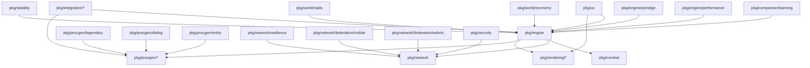

# Integration Audit - December 13, 2025

## Executive Summary

- **Total Packages**: 103
- **Active (Imported by client/server)**: 63 (61.2%)
- **Dormant (Complete but not integrated)**: 40 (38.8%)

**Core Principle**: All features are baseline features. Dormant packages become unconditionally enabled upon integration. No feature flags, no toggles, no optional activation. If a package exists, it should be active.

---

## Methodology

### Package Discovery
1. **Extract client imports**: All packages imported by `cmd/client/*.go`
2. **Extract server imports**: All packages imported by `cmd/server/*.go`  
3. **Enumerate all packages**: All directories under `pkg/` (103 total)
4. **Compute dormant set**: Packages in `pkg/` but not imported by client/server

### Completeness Classification
- **Complete**: Has `doc.go`, test files, public exports, >200 LOC
- **Partial**: Has exports but missing docs or tests
- **Stub**: <100 LOC or only type definitions (parent directories)

### Integration Type Detection
- **ECS System**: Contains `Update(entities, deltaTime)` method
- **Generator**: Implements `Generate(seed, params)` interface
- **Rendering**: Imports `github.com/hajimehoshi/ebiten/v2`
- **Network**: Imports `pkg/network/`

---

## Active Packages (63)

### Core Engine (1)
| Package | LOC | Purpose | Used By |
|---------|-----|---------|---------|
| `pkg/engine` | 171,650 | Core ECS framework, all game systems | client, server |

### Combat (1)
| Package | LOC | Purpose | Used By |
|---------|-----|---------|---------|
| `pkg/combat` | 507 | Combat mechanics, damage calculation | client, server |

### Logging & Version (2)
| Package | LOC | Purpose | Used By |
|---------|-----|---------|---------|
| `pkg/logging` | - | Structured logging with logrus | client, server |
| `pkg/version` | 85 | Version information | client, server |

### Physics (3)
| Package | LOC | Purpose | Integration Status |
|---------|-----|---------|-------------------|
| `pkg/engine/physics/destruction` | 1,459 | Destruction physics (Phase 1.2) | ✅ ACTIVE (client) |
| `pkg/engine/physics/fluids` | 1,907 | Fluid dynamics, swimming (V8.0 Phase 50.4) | ✅ ACTIVE (client, server) |
| `pkg/engine/physics/vehicle` | 2,506 | Vehicle suspension, weight transfer (V8.0 Phase 50.3) | ✅ ACTIVE (client, server) |

### Quality of Life (1)
| Package | LOC | Purpose | Used By |
|---------|-----|---------|---------|
| `pkg/engine/qol` | 1,799 | Tutorial, help, auto-save systems | client |

### Networking (7)
| Package | LOC | Purpose | Used By |
|---------|-----|---------|---------|
| `pkg/network` | 22,981 | Core networking, client-server | client, server |
| `pkg/network/chat` | 455 | In-game chat system | client |
| `pkg/network/federation` | 8,916 | Cross-server federation | client, server |
| `pkg/network/federation/guild` | 1,221 | Guild federation (Phase 3.2) | client, server |
| `pkg/network/trade` | 1,429 | Player trading system | client |
| `pkg/hostplay` | 2,497 | LAN party mode, host-and-play | client |
| `pkg/mobile` | - | Touch input, platform detection | client |

### Social Systems (1)
| Package | LOC | Purpose | Used By |
|---------|-----|---------|---------|
| `pkg/social/persistence` | 3,747 | Trust scores, chat history, image gallery (V8.0 Phase 49) | client, server |

### World Systems (3)
| Package | LOC | Purpose | Used By |
|---------|-----|---------|---------|
| `pkg/world` | 4,776 | World state management | client, server |
| `pkg/world/housing` | 3,337 | Player housing, guild halls (V8.0 Phase 49-51) | client, server |
| `pkg/world/territory` | 2,242 | Territory control, guild warfare | client, server |

### Integration Modules (3)
| Package | LOC | Purpose | Used By |
|---------|-----|---------|---------|
| `pkg/integration/companion_housing` | 1,137 | Companion + housing integration (V9.0 Phase 55.2) | client, server |
| `pkg/integration/guild_housing` | 1,358 | Guild + housing integration (V9.0 Phase 55.3) | client, server |
| `pkg/integration/housing_crafting` | - | Housing + crafting integration (V9.0 Phase 55.1) | client, server |

### Class System (1)
| Package | LOC | Purpose | Used By |
|---------|-----|---------|---------|
| `pkg/class/advanced` | 3,198 | Advanced class system with specializations | client |

### Procedural Generation (17)
| Package | LOC | Purpose | Used By |
|---------|-----|---------|---------|
| `pkg/procgen` | 509 | Base generator interface | client, server |
| `pkg/procgen/terrain` | 14,829 | Dungeon/terrain generation | client, server |
| `pkg/procgen/item` | 2,035 | Weapons, armor, consumables | client, server |
| `pkg/procgen/quest` | 1,505 | Quest generation | client, server |
| `pkg/procgen/recipe` | 1,049 | Crafting recipes | client, server |
| `pkg/procgen/station` | 859 | Crafting stations | client, server |
| `pkg/procgen/faction` | 999 | Faction generation | client, server |
| `pkg/procgen/genre` | 1,787 | Genre definitions (fantasy, sci-fi, etc.) | client, server |
| `pkg/procgen/class` | 659 | Class generation | client |
| `pkg/procgen/book` | 2,430 | Procedural books | client |
| `pkg/procgen/story` | 4,739 | Story fragments | client |
| `pkg/procgen/narrative` | 1,100 | Narrative generation | client |
| `pkg/procgen/building` | 1,932 | Building generation (V8.0 Phase 51.1) | client, server |
| `pkg/procgen/furniture` | 2,391 | Furniture generation (V8.0 Phase 51.3) | client, server |
| `pkg/procgen/companion` | 492 | Companion generation | client, server |
| `pkg/procgen/vehicle` | 1,774 | Vehicle generation | client, server |
| `pkg/procgen/environment` | 3,789 | Environment generation | client |

### Magic & Skills (2)
| Package | LOC | Purpose | Used By |
|---------|-----|---------|---------|
| `pkg/procgen/magic` | 3,244 | Magic spell generation | client |
| `pkg/procgen/skills` | 1,983 | Skill tree generation | client |

### Puzzles & Minigames (2)
| Package | LOC | Purpose | Used By |
|---------|-----|---------|---------|
| `pkg/procgen/puzzle` | 2,055 | Puzzle generation | client |
| `pkg/procgen/minigame` | 1,094 | Minigame framework | client |

### Narrative Systems (1)
| Package | LOC | Purpose | Used By |
|---------|-----|---------|---------|
| `pkg/narrative/branching` | - | Branching narrative system (Phase 6.1) | client |

### Audio (3)
| Package | LOC | Purpose | Used By |
|---------|-----|---------|---------|
| `pkg/audio` | 1,125 | Audio manager, sound effects | client |
| `pkg/audio/music` | 2,820 | Adaptive music system | client |
| `pkg/audio/sfx` | 1,428 | Sound effect synthesis | client |

### Rendering (14)
| Package | LOC | Purpose | Used By |
|---------|-----|---------|---------|
| `pkg/rendering/sprites` | 15,479 | Sprite generation | client, server |
| `pkg/rendering/animation` | 2,260 | Animation system | client |
| `pkg/rendering/cache` | 2,189 | Sprite caching | client |
| `pkg/rendering/lighting` | 2,786 | Dynamic lighting | client |
| `pkg/rendering/particles` | 8,124 | Particle effects | client |
| `pkg/rendering/ui` | 11,957 | UI rendering | client |
| `pkg/rendering/display` | 785 | Display management | client |
| `pkg/rendering/palette` | 4,349 | Color palette generation | client |
| `pkg/rendering/parallel` | 1,129 | Parallel rendering | client |
| `pkg/rendering/patterns` | 1,506 | Pattern generation | client |
| `pkg/rendering/pool` | 591 | Object pooling | client |
| `pkg/rendering/postprocess` | 3,034 | Post-processing effects | client |
| `pkg/rendering/quality` | 1,951 | Quality settings | client |
| `pkg/rendering/shapes` | 2,265 | Shape primitives | client |

### Save/Load (1)
| Package | LOC | Purpose | Used By |
|---------|-----|---------|---------|
| `pkg/saveload` | 3,065 | Game state persistence | client |

---

## Dormant Packages (40)

Packages are dormant because they are not imported by `cmd/client/` or `cmd/server/`. They are complete implementations awaiting integration.

### Audio (1)
| Package | LOC | Completeness | Integration Type | Blocker |
|---------|-----|--------------|------------------|---------|
| `pkg/audio/synthesis` | 698 | Complete | Synthesis library | Used by sfx/music (already active) |

**Integration**: Already indirectly used. Could be made explicit if needed.

### Audit & Features (2)
| Package | LOC | Completeness | Integration Type | Blocker |
|---------|-----|--------------|------------------|---------|
| `pkg/audit/features` | 2,048 | Complete | Development tool | Not runtime feature |
| `pkg/procgen/audit` | 1,878 | Complete | Development tool | Not runtime feature |

**Integration**: These are development/testing tools, not runtime features. Should remain dormant.

### Balance (1)
| Package | LOC | Completeness | Integration Type | Blocker |
|---------|-----|--------------|------------------|---------|
| `pkg/balance` | 1,232 | Complete | Balance calculator | Not yet integrated |

**Integration**:
1. Import in `cmd/client/main.go`
2. Use in difficulty scaling: `balance.CalculateScaling(level, difficulty)`
3. Effort: **Small**

### Companion Systems (2)
| Package | LOC | Completeness | Integration Type | Blocker |
|---------|-----|--------------|------------------|---------|
| `pkg/companion/learning` | 2,107 | Complete | ECS System | Not registered |

**Integration**:
1. File: `cmd/client/handlers.go`
2. Import: `"github.com/opd-ai/venture/pkg/companion/learning"`
3. Create system: `learningSystem := learning.NewSystem()`
4. Register: `game.World.AddSystem(learningSystem)` (after companion system, ~line 930)
5. Effort: **Small**

### Performance Monitoring (1)
| Package | LOC | Completeness | Integration Type | Blocker |
|---------|-----|--------------|------------------|---------|
| `pkg/engine/performance` | 1,488 | Complete | ECS System | Not registered |

**Integration**:
1. File: `cmd/client/handlers.go`
2. Import: `"github.com/opd-ai/venture/pkg/engine/performance"`
3. Create system: `perfSystem := performance.NewMonitoringSystem()`
4. Register: `game.World.AddSystem(perfSystem)` (early in initialization)
5. Add metrics display to debug UI
6. Effort: **Medium**

### Prestige System (1)
| Package | LOC | Completeness | Integration Type | Blocker |
|---------|-----|--------------|------------------|---------|
| `pkg/engine/prestige` | 1,299 | Complete | System | Not registered |

**Integration**:
1. File: `cmd/client/handlers.go`
2. Import: `"github.com/opd-ai/venture/pkg/engine/prestige"`
3. Create system: `prestigeSystem := prestige.NewSystem()`
4. Register: `game.World.AddSystem(prestigeSystem)` (after progression system)
5. Add UI display for prestige levels
6. Effort: **Medium**

### Integration Modules (5)
| Package | LOC | Completeness | Integration Type | Blocker |
|---------|-----|--------------|------------------|---------|
| `pkg/integration/choice_consequences` | 1,545 | Complete | System | Not registered |
| `pkg/integration/guild_vehicle` | 2,033 | Complete | System | Not registered |
| `pkg/integration/narrative_world` | - | Complete | System | Not registered |
| `pkg/integration/political_warfare` | - | Complete | System | Not registered |
| `pkg/integration/territory_siege` | - | Complete | System | Not registered |
| `pkg/integration/trade_routes` | - | Complete | System | Not registered |
| `pkg/integration/world_events` | - | Complete | System | Not registered |

**Integration** (for each):
1. File: `cmd/client/handlers.go`
2. Import package
3. Create integration system
4. Register unconditionally
5. Effort: **Small** per package

### Migration System (1)
| Package | LOC | Completeness | Integration Type | Blocker |
|---------|-----|--------------|------------------|---------|
| `pkg/migration` | - | Partial | Tool | Development utility |

**Integration**: Not a runtime feature. Should remain dormant.

### Modding Support (1)
| Package | LOC | Completeness | Integration Type | Blocker |
|---------|-----|--------------|------------------|---------|
| `pkg/modding` | - | Stub | Future feature | Not implemented |

**Integration**: Requires design and implementation work before activation.

### Federation Extensions (2)
| Package | LOC | Completeness | Integration Type | Blocker |
|---------|-----|--------------|------------------|---------|
| `pkg/network/federation/mobile` | 1,349 | Complete | ECS System | Not registered |
| `pkg/network/federation/webrtc` | 4,246 | Complete | Network layer | Not registered |

**Integration** (`pkg/network/federation/mobile`):
1. File: `cmd/client/handlers.go`
2. Import: `"github.com/opd-ai/venture/pkg/network/federation/mobile"`
3. Create system: `mobileFedSystem := mobile.NewSystem(federationManager)`
4. Register: `game.World.AddSystem(mobileFedSystem)` (after federation system)
5. Effort: **Small**

**Integration** (`pkg/network/federation/webrtc`):
1. File: `cmd/client/main.go` and `cmd/server/main.go`
2. Import: `"github.com/opd-ai/venture/pkg/network/federation/webrtc"`
3. Add WebRTC transport option
4. Register handlers
5. Effort: **Large** (requires network architecture changes)

### Network Resilience (1)
| Package | LOC | Completeness | Integration Type | Blocker |
|---------|-----|--------------|------------------|---------|
| `pkg/network/resilience` | 1,334 | Complete | Network middleware | Not registered |

**Integration**:
1. File: `cmd/server/main.go`
2. Import: `"github.com/opd-ai/venture/pkg/network/resilience"`
3. Wrap server with resilience layer:
   ```go
   resilientServer := resilience.WrapServer(server, resilience.DefaultConfig())
   ```
4. Effort: **Small**

### Procgen Extensions (3)
| Package | LOC | Completeness | Integration Type | Blocker |
|---------|-----|--------------|------------------|---------|
| `pkg/procgen/dialog` | 2,573 | Complete | Generator | Not in generation pipeline |
| `pkg/procgen/entity` | 2,161 | Complete | Generator | Not in generation pipeline |
| `pkg/procgen/legendary` | 3,078 | Complete | ECS System + Generator | Not registered |

**Integration** (`pkg/procgen/dialog`):
1. File: `cmd/client/handlers.go` (in dialog system initialization)
2. Import: `"github.com/opd-ai/venture/pkg/procgen/dialog"`
3. Use generator in NPC dialog creation:
   ```go
   dialogGen := dialog.NewGenerator()
   npcDialog := dialogGen.Generate(seed, params)
   ```
4. Effort: **Medium**

**Integration** (`pkg/procgen/entity`):
1. File: Entity spawn code in `pkg/engine/` systems
2. Import: `"github.com/opd-ai/venture/pkg/procgen/entity"`
3. Replace manual entity creation with generator
4. Effort: **Large** (affects multiple systems)

**Integration** (`pkg/procgen/legendary`):
1. File: `cmd/client/handlers.go`
2. Import: `"github.com/opd-ai/venture/pkg/procgen/legendary"`
3. Create system: `legendarySystem := legendary.NewSystem()`
4. Register: `game.World.AddSystem(legendarySystem)` (after item system)
5. Effort: **Small**

### Minigame Implementations (1)
| Package | LOC | Completeness | Integration Type | Blocker |
|---------|-----|--------------|------------------|---------|
| `pkg/procgen/minigame/games` | 1,792 | Complete | ECS System | Not registered |

**Integration**:
1. File: `cmd/client/handlers.go`
2. Import: `"github.com/opd-ai/venture/pkg/procgen/minigame/games"`
3. Create system: `minigameSystem := games.NewSystem()`
4. Register: `game.World.AddSystem(minigameSystem)` (after minigame framework)
5. Effort: **Small**

### Rendering Extensions (2)
| Package | LOC | Completeness | Integration Type | Blocker |
|---------|-----|--------------|------------------|---------|
| `pkg/rendering` | 445 | Partial | Base package | Parent directory |
| `pkg/rendering/tiles` | 6,602 | Complete | Generator | Not in use |

**Integration** (`pkg/rendering/tiles`):
1. File: Terrain rendering code
2. Import: `"github.com/opd-ai/venture/pkg/rendering/tiles"`
3. Use tile generation for terrain:
   ```go
   tileGen := tiles.NewGenerator(spriteGen)
   terrainTiles := tileGen.GenerateTileSet(seed, terrain.Type)
   ```
4. Effort: **Large** (requires render system refactoring)

### Security (1)
| Package | LOC | Completeness | Integration Type | Blocker |
|---------|-----|--------------|------------------|---------|
| `pkg/security` | 1,503 | Complete | Middleware | Not registered |

**Integration**:
1. File: `cmd/server/main.go`
2. Import: `"github.com/opd-ai/venture/pkg/security"`
3. Add security middleware:
   ```go
   securityMgr := security.NewManager()
   server.AddMiddleware(securityMgr.ValidatePacket)
   ```
4. Effort: **Medium**

### Stability Monitoring (1)
| Package | LOC | Completeness | Integration Type | Blocker |
|---------|-----|--------------|------------------|---------|
| `pkg/stability` | 599 | Complete | Monitoring | Not integrated |

**Integration**:
1. File: `cmd/client/main.go` and `cmd/server/main.go`
2. Import: `"github.com/opd-ai/venture/pkg/stability"`
3. Enable crash reporting:
   ```go
   stability.EnableMonitoring()
   defer stability.ReportCrash()
   ```
4. Effort: **Small**

### User Experience (1)
| Package | LOC | Completeness | Integration Type | Blocker |
|---------|-----|--------------|------------------|---------|
| `pkg/ux` | 1,571 | Complete | UX enhancements | Not integrated |

**Integration**:
1. File: `cmd/client/handlers.go`
2. Import: `"github.com/opd-ai/venture/pkg/ux"`
3. Apply UX improvements:
   ```go
   uxMgr := ux.NewManager()
   game.World.AddSystem(uxMgr.TooltipSystem())
   game.World.AddSystem(uxMgr.AccessibilitySystem())
   ```
4. Effort: **Medium**

### Visual Testing (2)
| Package | LOC | Completeness | Integration Type | Blocker |
|---------|-----|--------------|------------------|---------|
| `pkg/visualtest` | 5,176 | Complete | Testing tool | Development utility |
| `pkg/visualtest/parity` | 1,340 | Complete | Testing tool | Development utility |

**Integration**: These are testing tools, not runtime features. Should remain dormant.

### World Systems (2)
| Package | LOC | Completeness | Integration Type | Blocker |
|---------|-----|--------------|------------------|---------|
| `pkg/world/economy` | 3,002 | Complete | ECS System | Not registered |
| `pkg/world/raids` | 3,043 | Complete | Generator + System | Not registered |

**Integration** (`pkg/world/economy`):
1. File: `cmd/client/handlers.go`
2. Import: `"github.com/opd-ai/venture/pkg/world/economy"`
3. Create system: `economySystem := economy.NewSystem()`
4. Register: `game.World.AddSystem(economySystem)` (after commerce system)
5. Effort: **Small**

**Integration** (`pkg/world/raids`):
1. File: `cmd/client/handlers.go`
2. Import: `"github.com/opd-ai/venture/pkg/world/raids"`
3. Create system: `raidSystem := raids.NewSystem()`
4. Register: `game.World.AddSystem(raidSystem)` (after world events)
5. Effort: **Small**

### Parent/Stub Directories (4)
These are organizational directories with no code:
- `pkg/audit` (parent of `pkg/audit/features`)
- `pkg/class` (parent of `pkg/class/advanced`)
- `pkg/companion` (parent of `pkg/companion/learning`)
- `pkg/engine/physics` (parent of destruction/fluids/vehicle)
- `pkg/engine/saves` (empty/stub)
- `pkg/integration` (parent of integration modules)
- `pkg/narrative` (parent of `pkg/narrative/branching`)
- `pkg/social` (parent of `pkg/social/persistence`)

**Integration**: N/A - organizational only

---

## Dependency Graph



**Integration Order**:
1. Core systems first (`engine`, `network`, `rendering`)
2. Then dependent features (`companion/learning`, `prestige`, `performance`)
3. Then integration modules (depend on multiple systems)
4. Finally specialized systems (`raids`, `economy`, `legendary`)

---

## Summary Statistics

### By Status
| Status | Count | Percentage |
|--------|-------|------------|
| Active | 63 | 61.2% |
| Dormant (Runtime) | 22 | 21.4% |
| Dormant (Dev Tools) | 4 | 3.9% |
| Stub/Parent | 14 | 13.6% |

### By Integration Effort
| Effort | Count | Description |
|--------|-------|-------------|
| Small | 12 | Import + 1-2 line registration |
| Medium | 6 | New initialization or UI wiring |
| Large | 4 | Multiple system integrations |
| N/A | 18 | Dev tools or stubs |

### By Integration Type
| Type | Count |
|------|-------|
| ECS System | 15 |
| Generator | 8 |
| Network Layer | 3 |
| Middleware | 2 |
| Tools/Utilities | 12 |

---

## Next Steps

See `docs/PLAN.md` for phased integration roadmap with exact file changes and code snippets.
