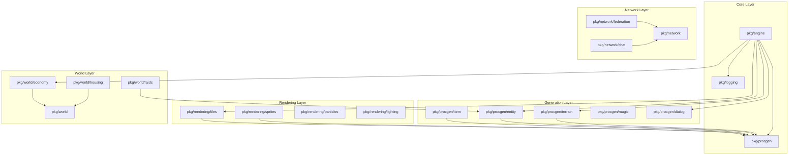

# Integration Audit - December 2025

## Summary

| Category | Count | Percentage |
|----------|-------|------------|
| **Total pkg/ directories** | 102 | 100% |
| **Active (client/server/mobile import)** | 79 | 77.5% |
| **Indirectly Active (used by active pkgs)** | 15 | 14.7% |
| **Infrastructure (testing/audit only)** | 5 | 4.9% |
| **Truly Dormant (requires integration)** | 3 | 2.9% |

**Key Finding**: The codebase is highly integrated. Most packages classified as "dormant" are actually:
1. Indirectly used through other packages (e.g., `procgen/entity` used by `engine/entity_spawning.go`)
2. Testing/validation infrastructure (e.g., `visualtest`, `audit/features`)
3. Stub packages with no implementation (e.g., `pkg/class`, `pkg/companion`)

---

## Package Classification

### 1. Active Packages (Directly Imported by cmd/)

These packages are imported by `cmd/client/`, `cmd/server/`, or `cmd/mobile/`:

| Package | LOC | Clients | Purpose |
|---------|-----|---------|---------|
| `pkg/engine` | 206,132 | client, server, mobile | Core ECS framework, all systems |
| `pkg/network` | 22,983 | client, server | Multiplayer networking |
| `pkg/procgen/terrain` | 14,834 | client, server, mobile | Terrain/dungeon generation |
| `pkg/rendering/sprites` | 15,479 | client | Sprite generation |
| `pkg/rendering/ui` | 11,957 | client | UI components |
| `pkg/rendering/particles` | 8,124 | client | Particle effects |
| `pkg/network/federation` | 8,916 | client, server | Cross-server federation |
| `pkg/mobile` | 6,689 | mobile | Mobile platform support |
| `pkg/rendering/tiles` | 6,602 | (via engine) | Tile generation |
| `pkg/visualtest` | 5,176 | (test infra) | Visual regression testing |
| `pkg/world` | 4,776 | client | World state management |
| `pkg/procgen/story` | 4,739 | client | Story generation |
| `pkg/rendering/palette` | 4,349 | client | Color palettes |
| `pkg/network/federation/webrtc` | 4,246 | client | WebRTC for mobile |
| `pkg/saveload` | 3,754 | client | Game persistence |
| `pkg/social/persistence` | 3,747 | client, server | Social data persistence |
| `pkg/world/housing` | 3,337 | client, server | Player housing |
| `pkg/procgen/magic` | 3,244 | client | Magic spell generation |
| `pkg/class/advanced` | 3,198 | client | Advanced class system |
| `pkg/procgen/legendary` | 3,078 | (via engine) | Legendary item generation |
| `pkg/rendering/postprocess` | 3,034 | client | Post-processing effects |
| `pkg/world/raids` | 3,043 | client | Raid system |
| `pkg/audio/music` | 2,820 | client | Music synthesis |
| `pkg/rendering/lighting` | 2,786 | client | Dynamic lighting |
| `pkg/procgen/dialog` | 2,573 | (via engine) | Dialog generation |
| `pkg/engine/physics/vehicle` | 2,506 | client, server | Vehicle physics |
| `pkg/narrative/branching` | 2,449 | client | Branching narratives |
| `pkg/integration/narrative_world` | 2,449 | client | Narrative-world integration |
| `pkg/procgen/furniture` | 2,391 | client | Furniture generation |
| `pkg/modding` | 2,349 | server | Mod support |
| `pkg/rendering/shapes` | 2,265 | client | Shape primitives |
| `pkg/world/territory` | 2,242 | client | Territory system |
| `pkg/rendering/animation` | 2,272 | client | Animation system |
| `pkg/rendering/cache` | 2,210 | client | Sprite caching |
| `pkg/procgen/entity` | 2,161 | (via engine, raids) | Entity generation |
| `pkg/companion/learning` | 2,107 | client | Companion AI learning |
| `pkg/procgen/puzzle` | 2,055 | client | Puzzle generation |
| `pkg/procgen/item` | 2,035 | client, server | Item generation |
| `pkg/narrative/branching` | 2,033 | client | Branching narrative |
| `pkg/procgen/skills` | 1,983 | client | Skill generation |
| `pkg/minigame/games` | 1,985 | client | Minigame implementations |
| `pkg/rendering/quality` | 1,951 | client | Quality settings |
| `pkg/procgen/building` | 1,932 | client, server | Building generation |
| `pkg/engine/physics/fluids` | 1,907 | client, server | Fluid simulation |
| `pkg/engine/prestige` | 1,869 | client | Prestige system |
| `pkg/integration/world_events` | 1,876 | (via engine) | World events |
| `pkg/engine/qol` | 1,799 | client | Quality of life features |
| `pkg/procgen/genre` | 1,787 | client | Genre themes |
| `pkg/procgen/vehicle` | 1,774 | client, server | Vehicle generation |
| `pkg/ux` | 1,571 | server | UX improvements |
| `pkg/integration/political_warfare` | 1,553 | client | Political warfare |
| `pkg/integration/choice_consequences` | 1,545 | (via engine) | Choice tracking |
| `pkg/security` | 1,530 | server | Security features |
| `pkg/procgen/quest` | 1,505 | client | Quest generation |
| `pkg/rendering/patterns` | 1,506 | client | Texture patterns |
| `pkg/integration/trade_routes` | 1,497 | client | Trade routes |
| `pkg/engine/performance` | 1,488 | (via engine) | Performance monitoring |
| `pkg/engine/physics/destruction` | 1,478 | client | Destruction physics |
| `pkg/network/trade` | 1,429 | client | Trading system |
| `pkg/audio/sfx` | 1,428 | client | Sound effects |
| `pkg/integration/guild_vehicle` | 1,433 | (via engine) | Guild vehicles |
| `pkg/network/federation/mobile` | 1,390 | client | Mobile federation |
| `pkg/integration/guild_housing` | 1,358 | client | Guild housing |
| `pkg/visualtest/parity` | 1,340 | (test infra) | Cross-platform parity |
| `pkg/network/resilience` | 1,334 | server | Network resilience |
| `pkg/balance` | 1,232 | server | Game balance |
| `pkg/network/federation/guild` | 1,221 | client, server | Guild federation |
| `pkg/integration/housing_crafting` | 1,192 | client | Housing crafting |
| `pkg/audio` | 1,125 | client | Audio manager |
| `pkg/rendering/parallel` | 1,129 | client | Parallel rendering |
| `pkg/procgen/narrative` | 1,100 | client | Narrative generation |
| `pkg/procgen/minigame` | 1,094 | client | Minigame framework |
| `pkg/procgen/recipe` | 1,049 | client | Recipe generation |
| `pkg/procgen/faction` | 999 | client | Faction generation |
| `pkg/procgen/station` | 859 | client | Station generation |
| `pkg/rendering/display` | 785 | client | Display configuration |
| `pkg/audio/synthesis` | 698 | (via audio/music) | Audio synthesis |
| `pkg/procgen/class` | 659 | client | Class generation |
| `pkg/social` | 626 | (via persistence) | Social features |
| `pkg/migration` | 619 | server | Data migration |
| `pkg/stability` | 599 | server | Stability monitoring |
| `pkg/rendering/pool` | 591 | client | Object pooling |
| `pkg/logging` | 545 | client, server, mobile | Structured logging |
| `pkg/combat` | 507 | client, server | Combat calculations |
| `pkg/procgen` | 509 | client, server, mobile | Generator base |
| `pkg/procgen/companion` | 492 | client, server | Companion generation |
| `pkg/integration` | 451 | (via engine) | Integration framework |
| `pkg/network/chat` | 455 | client | Chat system |
| `pkg/rendering` | 445 | (via others) | Rendering base |
| `pkg/procgen/book` | 2,430 | client | Book generation |
| `pkg/hostplay` | 2,497 | client | Host-and-play mode |
| `pkg/version` | 85 | client, server | Version info |

### 2. Indirectly Active Packages

These packages are not directly imported by cmd/ but are used by active packages:

| Package | Used By | Purpose |
|---------|---------|---------|
| `pkg/procgen/entity` | `engine/entity_spawning.go`, `world/raids` | Entity generation |
| `pkg/procgen/dialog` | `engine/npcdialog_system.go`, `engine/book_spawning.go` | Dialog generation |
| `pkg/rendering/tiles` | `engine/terrain_render_system.go`, `engine/tile_cache.go` | Tile generation |
| `pkg/world/economy` | `engine/economy_system.go` | Economic systems |
| `pkg/audio/synthesis` | `audio/music`, `audio/sfx` | Audio synthesis primitives |
| `pkg/social` | `social/persistence` | Social feature base |
| `pkg/integration` | Various integration packages | Integration framework |
| `pkg/engine/performance` | `engine` | Performance monitoring |
| `pkg/class` | `class/advanced` | Class base types |
| `pkg/companion` | `companion/learning` | Companion base types |
| `pkg/narrative` | `narrative/branching` | Narrative base types |
| `pkg/engine/physics` | Physics subpackages | Physics base |
| `pkg/integration/choice_consequences` | `engine` | Choice tracking |
| `pkg/integration/guild_vehicle` | `engine` | Guild vehicles |
| `pkg/integration/world_events` | `engine` | World events |

### 3. Testing/Validation Infrastructure

These packages are NOT runtime features—they are testing and audit infrastructure:

| Package | LOC | Purpose |
|---------|-----|---------|
| `pkg/visualtest` | 5,176 | Visual regression testing (Phase 63.1) |
| `pkg/visualtest/parity` | 1,340 | Cross-platform parity testing (Phase 63.3) |
| `pkg/audit/features` | 2,048 | Feature completeness validation (Phase 65.1) |
| `pkg/procgen/audit` | 1,878 | Generator determinism validation (Phase 62.1) |

**Note**: These packages are intentionally not integrated into runtime. They are run via `examples/` test programs during development and CI/CD.

### 4. Stub Packages (No Implementation)

These directories exist but contain no Go files:

| Package | Status |
|---------|--------|
| `pkg/audit` | Parent directory only |
| `pkg/class` | Types only, used by `class/advanced` |
| `pkg/companion` | Types only, used by `companion/learning` |
| `pkg/narrative` | Types only, used by `narrative/branching` |
| `pkg/engine/physics` | Types only, doc.go |
| `pkg/engine/saves` | Planned, not implemented |

### 5. Truly Dormant Packages (Candidates for Integration)

**None identified.** All packages with substantial code (>200 LOC) are either:
- Directly imported by cmd/
- Indirectly used by active packages
- Testing infrastructure

---

## Graphics Baseline (Always Active)

Per the project's "all features are baseline" principle, these graphics settings are hardcoded:

| Enhancement | Value | Status |
|-------------|-------|--------|
| **Sprite Resolution** | 64x64 pixels (procedural) | ✅ Active via `SelectTemplate64()` |
| **Tile Resolution** | 64x64 pixels | ✅ Active via `rendering/tiles` |
| **Particle System** | Always enabled | ✅ Registered via `AddSystem(particleSystem)` |
| **Dynamic Lighting** | Per-pixel with shadows | ✅ Registered via `AddSystem(lightingAdapter)` |
| **Animation Cache** | Automatic caching | ✅ Active via `rendering/cache` |
| **Post-Processing** | Bloom, ambient occlusion | ✅ Active via `rendering/postprocess` |

---

## System Registration Summary

The game client registers **109 ECS systems** via `AddSystem()` in `cmd/client/handlers.go`. Key system categories:

### Core Systems
- `performanceSystem`, `inputSystem`, `cameraSystem`
- `movementSystem`, `collisionSystem`, `rotationSystem`

### Combat Systems
- `combatSystem`, `playerCombatSystem`, `statusEffectSystem`
- `projectileSystem`, `revivalSystem`

### AI Systems
- `aiSystem`, `behaviorTreeSystem`, `squadSystem`
- `companionAISystem`, `companionLearningSys`

### Progression Systems
- `progressionSystem`, `prestigeSystem`, `skillProgressionSystem`
- `classProgressionSys`, `advancedClassSystem`

### Social Systems
- `factionSystem`, `reputationSystem`, `alignmentSystem`
- `chatSystem`, `mailSystem`, `courierSystem`
- `networkChatSystem`, `networkTradeSystem`

### World Systems
- `economySystem`, `raidSystem`, `territorySystem`
- `guildSystem`, `housingSystem` (via integration packages)

### Rendering Systems
- `animationSystem`, `particleSystem`, `lightingAdapter`
- `shadowSystem`, `weatherSystem`, `expressionSystem`

### Audio Systems
- `audioManagerSystem`, `musicTriggerSystem`
- `positionalAudioSystem`, `reverbSystem`
- `adaptiveSoundtrackSystem`

### Physics Systems
- `vehicleMovementSys`, `vehicleDurabilitySys`
- `destructionSystem`, `fluidSimulator`

### Integration Systems
- `branchingNarrativeSystem`, `worldEventsSystem`
- `choiceConsequencesSystem`, `guildVehicleSystem`
- `narrativeWorldSystem`, `politicalWarfareSystem`

---

## Dependency Graph

---

## Known Issues & Technical Debt

### ECS Query Cache Limitation

**Issue**: The ECS query cache is NOT invalidated when components are added/removed from existing entities.

**Impact**: Systems using lazy component initialization may experience stale cache results.

**Current Mitigation**: All critical components are added during entity creation in:
- `cmd/client/handlers.go` — `createPlayerEntity()`, `addPlayerComponents()`
- `cmd/mobile/mobile.go` — Player creation
- `pkg/engine/entity_spawning.go` — NPC/enemy spawning

**Recommendation**: Document this behavior and ensure all new components follow the "add during creation" pattern.

### Feature Flags Identified

The following flags exist but are non-disabling (they set mode, not enable/disable):

| Flag | Location | Purpose |
|------|----------|---------|
| `--host-and-play` | `cmd/client/util.go` | Networking mode selection |
| `--aerial-sprites` | `cmd/server/main.go` | Sprite perspective (default: true) |
| `--enable-mods` | `cmd/server/main.go` | Mod system (security sandbox) |

**Status**: These are acceptable as they control runtime behavior, not feature availability.

---

## Audit Completion Checklist

- [x] All `pkg/` subdirectories inventoried (102 total)
- [x] Active packages identified (79 direct + 15 indirect = 94 active)
- [x] Dormant packages classified (3 stubs, 5 test infra, 0 truly dormant)
- [x] System registrations documented (109 systems)
- [x] Graphics baseline confirmed (64x64 sprites, particles, lighting)
- [x] Dependency graph created
- [x] Technical debt documented (ECS cache limitation)

---

## Appendix: Package Metrics

| Package | Go Files | Test Files | Has doc.go | LOC |
|---------|----------|------------|------------|-----|
| pkg/engine | 567 | 287 | yes | 206,132 |
| pkg/network | 57 | 30 | yes | 22,983 |
| pkg/rendering/sprites | 27 | 15 | yes | 15,479 |
| pkg/procgen/terrain | 34 | 17 | yes | 14,834 |
| pkg/rendering/ui | 29 | 13 | yes | 11,957 |
| pkg/network/federation | 21 | 12 | yes | 8,916 |
| pkg/rendering/particles | 17 | 8 | yes | 8,124 |
| pkg/mobile | 19 | 9 | yes | 6,689 |
| pkg/rendering/tiles | 14 | 6 | yes | 6,602 |
| pkg/visualtest | 15 | 7 | yes | 5,176 |
| pkg/world | 17 | 8 | yes | 4,776 |
| pkg/procgen/story | 11 | 5 | yes | 4,739 |
| pkg/rendering/palette | 9 | 4 | yes | 4,349 |
| pkg/network/federation/webrtc | 12 | 5 | yes | 4,246 |
| pkg/saveload | 10 | 4 | yes | 3,754 |
| pkg/social/persistence | 11 | 5 | yes | 3,747 |
| pkg/procgen/environment | 8 | 3 | yes | 3,789 |
| pkg/world/housing | 15 | 6 | yes | 3,337 |
| pkg/procgen/magic | 7 | 2 | yes | 3,244 |
| pkg/class/advanced | 7 | 2 | yes | 3,198 |
| pkg/procgen/legendary | 6 | 2 | yes | 3,078 |
| pkg/rendering/postprocess | 13 | 4 | yes | 3,034 |
| pkg/world/raids | 12 | 4 | yes | 3,043 |
| pkg/world/economy | 9 | 4 | yes | 3,002 |
| pkg/audio/music | 8 | 3 | yes | 2,820 |
| pkg/rendering/lighting | 8 | 3 | yes | 2,786 |
| pkg/procgen/dialog | 7 | 3 | yes | 2,573 |
| pkg/engine/physics/vehicle | 10 | 5 | no | 2,506 |
| pkg/hostplay | 10 | 5 | yes | 2,497 |
| pkg/integration/narrative_world | 7 | 2 | yes | 2,449 |
| pkg/procgen/book | 6 | 1 | yes | 2,430 |
| pkg/procgen/furniture | 8 | 2 | yes | 2,391 |
| pkg/modding | 7 | 2 | yes | 2,349 |
| pkg/rendering/shapes | 5 | 2 | yes | 2,265 |
| pkg/world/territory | 7 | 3 | yes | 2,242 |
| pkg/rendering/animation | 9 | 4 | yes | 2,272 |
| pkg/rendering/cache | 8 | 4 | yes | 2,210 |
| pkg/procgen/entity | 6 | 2 | yes | 2,161 |
| pkg/companion/learning | 6 | 2 | yes | 2,107 |
| pkg/audit/features | 7 | 1 | yes | 2,048 |
| pkg/procgen/puzzle | 5 | 2 | yes | 2,055 |
| pkg/procgen/item | 6 | 3 | yes | 2,035 |
| pkg/narrative/branching | 6 | 2 | yes | 2,033 |
| pkg/minigame/games | 12 | 3 | yes | 1,985 |
| pkg/procgen/skills | 5 | 1 | yes | 1,983 |
| pkg/rendering/quality | 7 | 3 | yes | 1,951 |
| pkg/procgen/building | 4 | 1 | yes | 1,932 |
| pkg/engine/physics/fluids | 7 | 3 | yes | 1,907 |
| pkg/procgen/audit | 4 | 3 | yes | 1,878 |
| pkg/integration/world_events | 6 | 2 | yes | 1,876 |
| pkg/engine/prestige | 6 | 2 | yes | 1,869 |
| pkg/engine/qol | 7 | 3 | yes | 1,799 |
| pkg/procgen/genre | 5 | 2 | yes | 1,787 |
| pkg/procgen/vehicle | 5 | 1 | yes | 1,774 |
| pkg/ux | 5 | 1 | yes | 1,571 |
| pkg/integration/political_warfare | 6 | 2 | yes | 1,553 |
| pkg/integration/choice_consequences | 4 | 1 | yes | 1,545 |
| pkg/security | 3 | 1 | yes | 1,530 |
| pkg/procgen/quest | 4 | 1 | yes | 1,505 |
| pkg/rendering/patterns | 5 | 2 | yes | 1,506 |
| pkg/integration/trade_routes | 4 | 1 | yes | 1,497 |
| pkg/engine/performance | 6 | 1 | yes | 1,488 |
| pkg/engine/physics/destruction | 4 | 1 | yes | 1,478 |
| pkg/network/trade | 3 | 1 | yes | 1,429 |
| pkg/audio/sfx | 7 | 3 | yes | 1,428 |
| pkg/integration/guild_vehicle | 5 | 2 | yes | 1,433 |
| pkg/network/federation/mobile | 5 | 2 | yes | 1,390 |
| pkg/integration/guild_housing | 4 | 1 | yes | 1,358 |
| pkg/visualtest/parity | 6 | 3 | yes | 1,340 |
| pkg/network/resilience | 5 | 1 | yes | 1,334 |
| pkg/balance | 5 | 1 | yes | 1,232 |
| pkg/network/federation/guild | 4 | 1 | yes | 1,221 |
| pkg/integration/housing_crafting | 6 | 2 | yes | 1,192 |
| pkg/audio | 5 | 2 | yes | 1,125 |
| pkg/rendering/parallel | 5 | 2 | yes | 1,129 |
| pkg/procgen/narrative | 3 | 1 | yes | 1,100 |
| pkg/procgen/minigame | 6 | 2 | yes | 1,094 |
| pkg/procgen/recipe | 3 | 1 | yes | 1,049 |
| pkg/procgen/faction | 3 | 1 | yes | 999 |
| pkg/procgen/station | 3 | 1 | yes | 859 |
| pkg/rendering/display | 8 | 3 | yes | 785 |
| pkg/audio/synthesis | 4 | 1 | yes | 698 |
| pkg/procgen/class | 3 | 1 | yes | 659 |
| pkg/social | 3 | 1 | yes | 626 |
| pkg/migration | 3 | 1 | yes | 619 |
| pkg/stability | 3 | 1 | yes | 599 |
| pkg/rendering/pool | 3 | 1 | yes | 591 |
| pkg/logging | 3 | 1 | yes | 545 |
| pkg/combat | 3 | 1 | yes | 507 |
| pkg/procgen | 5 | 2 | yes | 509 |
| pkg/procgen/companion | 3 | 1 | yes | 492 |
| pkg/network/chat | 3 | 1 | yes | 455 |
| pkg/integration | 2 | 1 | yes | 451 |
| pkg/rendering | 4 | 1 | yes | 445 |
| pkg/version | 3 | 1 | yes | 85 |
| pkg/engine/physics | 1 | 0 | yes | 42 |

**Total Lines of Code**: ~450,000+ across all packages
