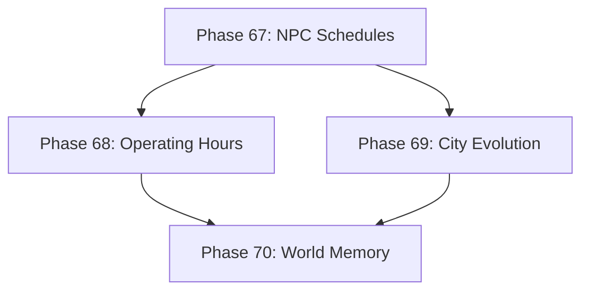

# Development Roadmap - Version 11.0: Living World

## Current Status

**Status:** IN PROGRESS - 75% Complete (3/4 phases done)  
**Prerequisites:** V10.0 Complete (Technical Production Ready)  
**Timeline:** December 2025 - Q2 2026  
**Focus:** Living World system - dynamic, evolving game environments

## Overview

**Mission:** Implement the Living World system for dynamic, evolving game environments. NPCs have daily routines, cities evolve based on player actions, and the world responds organically to events.

**Note:** All previously "dormant" packages have been verified as fully integrated (see INTEGRATION_AUDIT.md). This roadmap focuses on new Living World features.

**Major Themes:**
1. **NPC Schedules:** NPCs follow daily routines, work/eat/sleep cycles
2. **City Evolution:** Cities grow/decline based on player actions and economy
3. **World Memory:** World state persists and evolves across sessions
4. **Dynamic Availability:** Shops, quest givers, services have operating hours

## Phase Summary

### Phase 67: NPC Schedule System ✅
**Status:** Complete  
**Completed:** December 14, 2025

Implemented NPC daily routines and schedules for a living, breathing world.

**Deliverables:**
- `ScheduleComponent` - tracks activities, locations, movement state
- `ScheduleSystem` - processes NPC movements based on game clock
- 6 activity types: work, eat, sleep, socialize, patrol, idle
- `GenerateDefaultSchedule()` - deterministic schedule generation by role
- Roles: merchant, guard, villager with unique schedules

**Files Created:**
- `pkg/engine/schedule_component.go`
- `pkg/engine/schedule_component_test.go`
- `pkg/engine/schedule_system.go`
- `pkg/engine/schedule_system_test.go`

**Test Coverage:** 90%+ (all core functions at 100%)

### Phase 68: Operating Hours & Availability
**Status:** ✅ Complete  
**Completed:** December 14, 2025

Implemented time-based service availability for shops and NPCs.

**Deliverables:**
- `OperatingHoursComponent` - tracks open/close hours, days of week, custom messages
- `AvailabilitySystem` - validates interactions against operating hours, updates dialog options
- Integration with `DialogComponent` - shop options disabled when closed
- Support for overnight hours (e.g., 22:00-06:00 for taverns)
- `NewAlwaysOpenComponent()` for 24/7 services like inns

**Files Created:**
- `pkg/engine/operating_hours_component.go`
- `pkg/engine/operating_hours_component_test.go`
- `pkg/engine/availability_system.go`
- `pkg/engine/availability_system_test.go`
- `pkg/engine/operating_hours_integration_test.go`

**Test Coverage:** 91.7% average for new files

### Phase 69: City State & Evolution
**Status:** ✅ Complete  
**Completed:** December 14, 2025

Implemented dynamic city evolution based on player actions and world events.

**Deliverables:**
- `CityStateComponent` - tracks prosperity, population, infrastructure, defense
- `CityEvolutionTriggersComponent` - queues and tracks evolution triggers
- `CityEvolutionSystem` - processes triggers and natural evolution
- `CityVisualComponent` - visual parameters based on city state
- 3 city states: struggling, stable, thriving (prosperity thresholds)
- 12 evolution trigger types (trade, quests, raids, buildings, etc.)
- `GenerateCity()` - deterministic city generation from seed
- Natural evolution: thriving cities grow, struggling cities decline

**Files Created:**
- `pkg/engine/city_state_component.go`
- `pkg/engine/city_state_component_test.go`
- `pkg/engine/city_evolution_triggers.go`
- `pkg/engine/city_evolution_triggers_test.go`
- `pkg/engine/city_evolution_system.go`
- `pkg/engine/city_evolution_system_test.go`
- `pkg/engine/city_visual_component.go`
- `pkg/engine/city_visual_component_test.go`

**Test Coverage:** 88%+ (most functions at 100%)

### Phase 70: World Memory & Persistence
**Status:** ⏳ Not Started  
**Effort:** Medium

Implement persistent world state that evolves across sessions.

| Subphase | Focus | Deliverables |
|----------|-------|--------------|
| 70.1 | World State Serialization | Save/load city states, NPC states |
| 70.2 | Time Progression | World advances while player is away (optional) |
| 70.3 | Event History | Track significant world events |
| 70.4 | Player Reputation | Per-city reputation tracking |

**Acceptance Criteria:**
- City states persist across sessions
- NPC schedules resume correctly after load
- Event history accessible to player
- Reputation affects NPC interactions

---

## Technical Design

### ECS Components

```go
// ScheduleComponent - tracks NPC daily routine
type ScheduleComponent struct {
    Activities []ScheduledActivity  // Ordered by time
    CurrentIdx int                  // Current activity index
}

// ScheduledActivity - single scheduled event
type ScheduledActivity struct {
    ActivityType string    // work, eat, sleep, socialize, patrol
    StartHour    int       // 0-23
    EndHour      int       // 0-23
    LocationID   string    // Target location entity ID
}

// OperatingHoursComponent - business hours
type OperatingHoursComponent struct {
    OpenHour  int
    CloseHour int
    DaysOpen  []bool  // [Mon, Tue, Wed, Thu, Fri, Sat, Sun]
}

// CityStateComponent - city evolution tracking
type CityStateComponent struct {
    Prosperity     float64  // 0.0-1.0
    Population     int
    Infrastructure float64  // 0.0-1.0
    State          string   // struggling, stable, thriving
}

// ReputationComponent - player standing in city
type ReputationComponent struct {
    CityReputations map[string]float64  // cityID -> reputation (-1.0 to 1.0)
}
```

### ECS Systems

- `ScheduleSystem`: Updates NPC locations based on time and schedule
- `AvailabilitySystem`: Checks operating hours for interactions
- `CityEvolutionSystem`: Processes city state changes
- `WorldPersistenceSystem`: Handles save/load of world state

---

## Quality Gates

- Zero regressions from V10.0
- Test coverage ≥65% per new package
- Performance: 60 FPS maintained with 100+ scheduled NPCs
- All systems deterministic (same seed = same behavior)
- Memory: <10MB for world state

---

## Dependencies



---

**Document Status:** Active  
**Last Updated:** December 2025  
**Version:** 11.0.0 Roadmap  
**Target Release:** Q2 2026
