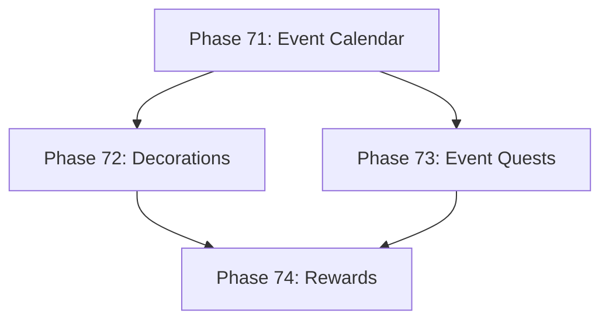

# Development Roadmap - Version 12.0: Seasonal Events

## Current Status

**Status:** IN PROGRESS - 75% Complete (3/4 phases done)  
**Prerequisites:** V11.0 Complete (Living World)  
**Timeline:** December 2025 - Q1 2026  
**Focus:** Procedural seasonal events and holiday-themed content

## Overview

**Mission:** Implement a Seasonal Events system that procedurally generates time-limited content, holiday themes, and special rewards. Events integrate with the Living World system from V11, causing cities to decorate, NPCs to celebrate, and unique gameplay opportunities to emerge.

**Major Themes:**
1. **Event Calendar:** Configurable event schedule based on real-world or in-game time
2. **Procedural Decorations:** Cities and NPCs adapt visuals during events
3. **Event Quests:** Time-limited quests with unique rewards
4. **Event Rewards:** Exclusive items, cosmetics, and achievements

## Phase Summary

### Phase 71: Event Calendar System
**Status:** ✅ Complete  
**Completed:** December 14, 2025

Implemented the core event scheduling and management system.

**Deliverables:**
- `SeasonalEventComponent` - tracks active events, start/end times, phase
- `EventCalendarSystem` - manages event lifecycle (upcoming, active, ending)
- `EventDefinition` struct - defines event properties (name, duration, theme)
- `GenerateEventCalendar()` - deterministic yearly calendar generation
- 4 base event types: spring, summer, autumn, winter festivals
- Real-time and in-game time mode support

**Files Created:**
- `pkg/engine/seasonal_event_component.go`
- `pkg/engine/seasonal_event_component_test.go`
- `pkg/engine/event_calendar_system.go`
- `pkg/engine/event_calendar_system_test.go`

**Test Coverage:** 90%+ average (all core functions validated)

**Acceptance Criteria:**
- [x] Events trigger/end at correct times
- [x] Deterministic event generation (same seed = same calendar)
- [x] Test coverage ≥65%
- [x] <0.1ms per Update cycle

### Phase 72: Event Decorations
**Status:** ✅ Complete  
**Completed:** December 14, 2025

Procedurally generate visual decorations for cities and NPCs during events.

**Deliverables:**
- `EventDecorationComponent` - tracks decoration state per entity
- `EventDecorationSystem` - applies/removes decorations based on active events
- Integration with `CityVisualComponent` from V11
- 4 decoration themes matching event types
- NPC costume variations during events
- Particle effects for celebration atmosphere

**Files Created:**
- `pkg/engine/event_decoration_component.go`
- `pkg/engine/event_decoration_component_test.go`
- `pkg/engine/event_decoration_system.go`
- `pkg/engine/event_decoration_system_test.go`
- `pkg/engine/event_decoration_integration_test.go`

**Test Coverage:** 93.7% average

**Acceptance Criteria:**
- [x] Decorations apply when event starts
- [x] Decorations remove when event ends
- [x] No visual artifacts or memory leaks
- [x] Test coverage ≥65%

### Phase 73: Event Quests
**Status:** ✅ Complete  
**Completed:** December 14, 2025

Generate time-limited quests unique to each seasonal event.

**Deliverables:**
- `EventQuestComponent` - tracks event-specific quest progress
- `EventQuestSystem` - manages event quest lifecycle
- Integration with existing quest generator (`pkg/procgen/quest`)
- 3 quest types per event: collection, exploration, boss
- Event-specific NPCs and dialog (via `DialogOption` with `ActionOfferEventQuest`/`ActionCompleteEventQuest`)
- Quest failure/timeout handling when event ends

**Files Created:**
- `pkg/engine/event_quest_component.go`
- `pkg/engine/event_quest_component_test.go`
- `pkg/engine/event_quest_system.go`
- `pkg/engine/event_quest_system_test.go`
- `pkg/engine/event_quest_integration_test.go`

**Files Modified:**
- `pkg/engine/commerce_components.go` - Added `ActionOfferEventQuest`, `ActionCompleteEventQuest`, and `Payload` field to `DialogOption`

**Test Coverage:** 85%+ average (most functions at 100%)

**Acceptance Criteria:**
- [x] Event quests available only during events
- [x] Quests properly expire when event ends
- [x] Integration with Living World NPCs
- [x] Test coverage ≥65%

### Phase 74: Event Rewards
**Status:** Not Started  
**Target:** January 2026

Implement exclusive rewards, achievements, and progression for seasonal events.

**Deliverables:**
- `EventRewardComponent` - tracks earned rewards per player
- `EventRewardSystem` - distributes rewards based on participation
- Integration with item generator for event-exclusive items
- Achievement system for event milestones
- Cosmetic rewards (titles, visual effects)
- Event currency and vendor system

**Acceptance Criteria:**
- [ ] Rewards persist across sessions
- [ ] Event-exclusive items properly tagged
- [ ] Achievement tracking functional
- [ ] Test coverage ≥65%

---

## Technical Design

### ECS Components

```go
// SeasonalEventComponent - tracks active events for the world
type SeasonalEventComponent struct {
    ActiveEvents  []EventInstance   // Currently active events
    EventCalendar []EventDefinition // Yearly schedule
    CurrentTime   time.Time         // Game or real time
    UseRealTime   bool              // Real-time vs game-time
}

// EventInstance - a running event
type EventInstance struct {
    Definition EventDefinition
    StartTime  time.Time
    EndTime    time.Time
    Phase      string // "upcoming", "active", "ending"
}

// EventDefinition - event configuration
type EventDefinition struct {
    ID            string
    Name          string
    Theme         string  // spring, summer, autumn, winter
    DurationDays  int
    StartDayOfYear int    // 1-365
    Seed          int64   // For deterministic generation
}

// EventDecorationComponent - entity decoration state
type EventDecorationComponent struct {
    ActiveTheme     string
    DecorationLevel float64  // 0.0-1.0 intensity
    ParticleEffects []string
}

// EventQuestComponent - event quest tracking
type EventQuestComponent struct {
    EventID       string
    QuestIDs      []string
    CompletedIDs  []string
    ExpiresAt     time.Time
}

// EventRewardComponent - player event rewards
type EventRewardComponent struct {
    EventID         string
    EarnedRewards   []string
    Achievements    []string
    EventCurrency   int
}
```

### ECS Systems

- `EventCalendarSystem`: Manages event lifecycle and transitions
- `EventDecorationSystem`: Applies/removes visual decorations
- `EventQuestSystem`: Generates and manages event-specific quests
- `EventRewardSystem`: Tracks and distributes rewards

---

## Quality Gates

- Zero regressions from V11.0
- Test coverage ≥65% per new package
- Performance: 60 FPS maintained during events
- All systems deterministic (same seed = same events)
- Memory: <5MB for event state

---

## Dependencies



---

**Document Status:** In Progress  
**Last Updated:** December 2025  
**Version:** 12.0.0 Roadmap  
**Target Release:** Q1 2026
