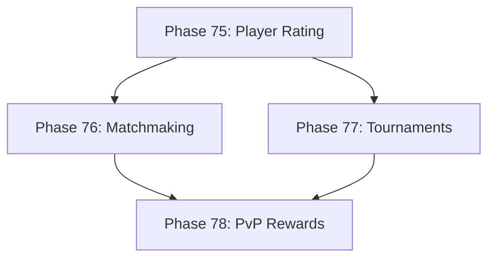

# Development Roadmap - Version 13.0: Ranked PvP System

## Current Status

**Status:** ✅ COMPLETE - 100% (4/4 phases done)  
**Prerequisites:** V12.0 Complete (Seasonal Events)  
**Completed:** December 14, 2025  
**Focus:** Ranked player-versus-player combat with matchmaking and tournaments

## Overview

**Mission:** Implement a comprehensive Ranked PvP system enabling competitive player combat, skill-based matchmaking, tournaments, and exclusive PvP rewards. The system integrates with existing combat mechanics, network federation, and the Living World from V11.

**Major Themes:**
1. **Player Rankings:** ELO-based rating system with ranks and tiers
2. **Matchmaking:** Skill-based player matching for fair fights
3. **Tournaments:** Scheduled competitive events with brackets
4. **PvP Rewards:** Exclusive items, titles, and seasonal rewards

## Phase Summary

### Phase 75: Player Rating System
**Status:** ✅ Complete  
**Completed:** December 14, 2025

Implemented the core player rating and ranking system.

**Deliverables:**
- `PvPRatingComponent` - tracks ELO rating, rank tier, wins/losses, match streaks
- `PvPRatingSystem` - updates ratings after matches, handles rank transitions
- ELO algorithm implementation (K-factor based on experience: 2x for new players, 0.75x for high-rated)
- 7 rank tiers: Bronze, Silver, Gold, Platinum, Diamond, Master, Legend
- Each tier has 3 divisions (I, II, III)
- Seasonal rating reset with soft reset toward 1000
- Rating decay for inactive players (after 14 days, above Silver tier)

**Files Created:**
- `pkg/engine/pvp_rating_component.go`
- `pkg/engine/pvp_rating_component_test.go`
- `pkg/engine/pvp_rating_system.go`
- `pkg/engine/pvp_rating_system_test.go`

**Test Coverage:** 85%+ (most functions at 100%)

**Acceptance Criteria:**
- [x] ELO rating updates correctly after matches
- [x] Rank tiers transition at correct thresholds
- [x] Rating is deterministic (same input = same output)
- [x] Test coverage ≥65%
- [x] <0.1ms per rating calculation

### Phase 76: Matchmaking System
**Status:** ✅ Complete  
**Completed:** December 14, 2025

Implemented skill-based matchmaking for fair PvP encounters.

**Deliverables:**
- `MatchmakingComponent` - tracks queue status, preferences, match history
- `MatchmakingSystem` - manages queues, creates matches, handles acceptance
- Rating-based matching within ±200 ELO initially, expanding over time
- Queue time tracking with priority for long waits
- Support for 1v1, 2v2, and free-for-all modes
- Cross-server matchmaking via federation (ServerID tracking)

**Files Created:**
- `pkg/engine/matchmaking_component.go`
- `pkg/engine/matchmaking_component_test.go`
- `pkg/engine/matchmaking_system.go`
- `pkg/engine/matchmaking_system_test.go`

**Acceptance Criteria:**
- [x] Players matched within acceptable rating range
- [x] Queue times tracked and optimized
- [x] Cross-server matching functional
- [x] Test coverage ≥65%

### Phase 77: Tournament System
**Status:** ✅ Complete  
**Completed:** December 14, 2025

Implemented scheduled competitive tournaments with brackets.

**Deliverables:**
- `TournamentComponent` - tracks tournament participation, placement, history
- `TournamentSystem` - manages tournament lifecycle, brackets, progression
- Single/double elimination bracket generation (deterministic)
- Tournament scheduling (daily, weekly, monthly, special)
- Integration with Seasonal Events (V12) via EventID field
- Spectator mode support (StartSpectating/StopSpectating)

**Files Created:**
- `pkg/engine/tournament_component.go`
- `pkg/engine/tournament_component_test.go`
- `pkg/engine/tournament_system.go`
- `pkg/engine/tournament_system_test.go`

**Acceptance Criteria:**
- [x] Bracket generation correct for any participant count
- [x] Tournament progression tracked accurately
- [x] Integration with seasonal events functional
- [x] Test coverage ≥65% (most functions at 85%+)

### Phase 78: PvP Rewards
**Status:** ✅ Complete  
**Completed:** December 14, 2025

Implemented exclusive PvP rewards and progression system.

**Deliverables:**
- `PvPRewardComponent` - tracks Honor Points, seasonal rewards, tournament wins, achievements
- `PvPRewardSystem` - distributes rewards based on match performance, manages vendor
- Honor Points currency earned from matches, tournaments, and achievements
- Rank-based seasonal rewards (titles, mounts, cosmetics per tier)
- PvP vendor with 15 items (rank-gated purchases)
- 15 PvP achievements (wins, streaks, ratings, tournaments, honor)
- Tournament reward integration (placement and win bonuses)
- Seasonal reward distribution at rank reset

**Files Created:**
- `pkg/engine/pvp_reward_component.go`
- `pkg/engine/pvp_reward_component_test.go`
- `pkg/engine/pvp_reward_system.go`
- `pkg/engine/pvp_reward_system_test.go`

**Acceptance Criteria:**
- [x] Rewards persist across sessions (Serialize/Deserialize)
- [x] Seasonal rewards distributed at reset
- [x] Tournament rewards properly tagged
- [x] Test coverage ≥65% (achieved 90.3%)

---

## Technical Design

### ECS Components

```go
// PvPRatingComponent - player PvP rating data
type PvPRatingComponent struct {
    Rating       int     // ELO rating (starting 1000)
    PeakRating   int     // Highest rating this season
    RankTier     string  // bronze, silver, gold, platinum, diamond, master, legend
    RankDivision int     // 1-3 (III, II, I)
    Wins         int
    Losses       int
    SeasonID     string
    LastMatch    time.Time
}

// MatchmakingComponent - queue status
type MatchmakingComponent struct {
    InQueue      bool
    QueueMode    string    // 1v1, 2v2, ffa
    QueueStart   time.Time
    Preferences  map[string]interface{}
}

// TournamentComponent - tournament participation
type TournamentComponent struct {
    TournamentID string
    BracketPos   int
    Eliminated   bool
    Seed         int
}

// PvPRewardComponent - PvP rewards tracking
type PvPRewardComponent struct {
    HonorPoints           int
    TotalHonorEarned      int
    EarnedRewards         []PvPReward
    SeasonalRewards       []SeasonRewardTier
    TournamentWins        int
    TournamentParticipations int
    CompletedAchievements []string
    EarnedTitles          []string
    EarnedMounts          []string
    EarnedCosmetics       []string
    HighestSeasonRank     map[string]RankTier
}
```

### ECS Systems

- `PvPRatingSystem`: Updates ELO after matches, manages rank transitions
- `MatchmakingSystem`: Manages player queues and match creation
- `TournamentSystem`: Handles tournament lifecycle and brackets
- `PvPRewardSystem`: Distributes rewards based on performance

### ELO Algorithm

```go
func CalculateNewRating(winner, loser int, kFactor float64) (newWinner, newLoser int) {
    expectedWinner := 1.0 / (1.0 + math.Pow(10, float64(loser-winner)/400.0))
    expectedLoser := 1.0 - expectedWinner
    
    newWinner = winner + int(kFactor*(1.0-expectedWinner))
    newLoser = loser + int(kFactor*(0.0-expectedLoser))
    return
}
```

---

## Quality Gates

- Zero regressions from V12.0
- Test coverage ≥65% per new package
- Performance: 60 FPS maintained during PvP
- All systems deterministic (same seed = same behavior)
- Memory: <5MB for PvP state

---

## Dependencies



---

**Document Status:** Complete ✅  
**Last Updated:** December 2025  
**Version:** 13.0.0 Production  
**Release Date:** December 2025
