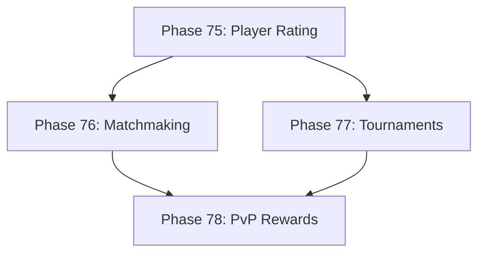

# Development Roadmap - Version 13.0: Ranked PvP System

## Current Status

**Status:** IN PROGRESS - 0% Complete (0/4 phases done)  
**Prerequisites:** V12.0 Complete (Seasonal Events)  
**Timeline:** December 2025 - Q1 2026  
**Focus:** Ranked player-versus-player combat with matchmaking and tournaments

## Overview

**Mission:** Implement a comprehensive Ranked PvP system enabling competitive player combat, skill-based matchmaking, tournaments, and exclusive PvP rewards. The system integrates with existing combat mechanics, network federation, and the Living World from V11.

**Major Themes:**
1. **Player Rankings:** ELO-based rating system with ranks and tiers
2. **Matchmaking:** Skill-based player matching for fair fights
3. **Tournaments:** Scheduled competitive events with brackets
4. **PvP Rewards:** Exclusive items, titles, and seasonal rewards

## Phase Summary

### Phase 75: Player Rating System
**Status:** ⏳ Pending  
**Target:** December 2025

Implement the core player rating and ranking system.

**Deliverables:**
- `PvPRatingComponent` - tracks ELO rating, rank tier, wins/losses
- `PvPRatingSystem` - updates ratings after matches, handles rank transitions
- ELO algorithm implementation (K-factor based on experience)
- 7 rank tiers: Bronze, Silver, Gold, Platinum, Diamond, Master, Legend
- Each tier has 3 divisions (I, II, III)
- Seasonal rating reset with rewards based on peak rank
- Rating decay for inactive players

**Files to Create:**
- `pkg/engine/pvp_rating_component.go`
- `pkg/engine/pvp_rating_component_test.go`
- `pkg/engine/pvp_rating_system.go`
- `pkg/engine/pvp_rating_system_test.go`

**Acceptance Criteria:**
- [ ] ELO rating updates correctly after matches
- [ ] Rank tiers transition at correct thresholds
- [ ] Rating is deterministic (same input = same output)
- [ ] Test coverage ≥65%
- [ ] <0.1ms per rating calculation

### Phase 76: Matchmaking System
**Status:** ⏳ Pending  
**Target:** January 2026

Implement skill-based matchmaking for fair PvP encounters.

**Deliverables:**
- `MatchmakingComponent` - tracks queue status, preferences
- `MatchmakingSystem` - manages queues, creates matches
- Rating-based matching within ±200 ELO initially, expanding over time
- Queue time tracking with priority for long waits
- Support for 1v1, 2v2, and free-for-all modes
- Cross-server matchmaking via federation

**Files to Create:**
- `pkg/engine/matchmaking_component.go`
- `pkg/engine/matchmaking_component_test.go`
- `pkg/engine/matchmaking_system.go`
- `pkg/engine/matchmaking_system_test.go`

**Acceptance Criteria:**
- [ ] Players matched within acceptable rating range
- [ ] Queue times tracked and optimized
- [ ] Cross-server matching functional
- [ ] Test coverage ≥65%

### Phase 77: Tournament System
**Status:** ⏳ Pending  
**Target:** January 2026

Implement scheduled competitive tournaments with brackets.

**Deliverables:**
- `TournamentComponent` - tracks tournament state, participants
- `TournamentSystem` - manages tournament lifecycle
- Single/double elimination bracket generation
- Tournament scheduling (daily, weekly, special events)
- Integration with Seasonal Events (V12) for event tournaments
- Spectator mode support

**Files to Create:**
- `pkg/engine/tournament_component.go`
- `pkg/engine/tournament_component_test.go`
- `pkg/engine/tournament_system.go`
- `pkg/engine/tournament_system_test.go`

**Acceptance Criteria:**
- [ ] Bracket generation correct for any participant count
- [ ] Tournament progression tracked accurately
- [ ] Integration with seasonal events functional
- [ ] Test coverage ≥65%

### Phase 78: PvP Rewards
**Status:** ⏳ Pending  
**Target:** February 2026

Implement exclusive PvP rewards and progression.

**Deliverables:**
- `PvPRewardComponent` - tracks earned PvP rewards, currency
- `PvPRewardSystem` - distributes rewards based on performance
- PvP currency (Honor Points) for exclusive vendor
- Rank-based seasonal rewards (mounts, titles, cosmetics)
- Tournament rewards (unique items per event)
- PvP achievements with permanent rewards

**Files to Create:**
- `pkg/engine/pvp_reward_component.go`
- `pkg/engine/pvp_reward_component_test.go`
- `pkg/engine/pvp_reward_system.go`
- `pkg/engine/pvp_reward_system_test.go`

**Acceptance Criteria:**
- [ ] Rewards persist across sessions
- [ ] Seasonal rewards distributed at reset
- [ ] Tournament rewards properly tagged
- [ ] Test coverage ≥65%

---

## Technical Design

### ECS Components

```go
// PvPRatingComponent - player PvP rating data
type PvPRatingComponent struct {
    Rating       int     // ELO rating (starting 1000)
    PeakRating   int     // Highest rating this season
    RankTier     string  // bronze, silver, gold, platinum, diamond, master, legend
    RankDivision int     // 1-3 (III, II, I)
    Wins         int
    Losses       int
    SeasonID     string
    LastMatch    time.Time
}

// MatchmakingComponent - queue status
type MatchmakingComponent struct {
    InQueue      bool
    QueueMode    string    // 1v1, 2v2, ffa
    QueueStart   time.Time
    Preferences  map[string]interface{}
}

// TournamentComponent - tournament participation
type TournamentComponent struct {
    TournamentID string
    BracketPos   int
    Eliminated   bool
    Seed         int
}

// PvPRewardComponent - PvP rewards tracking
type PvPRewardComponent struct {
    HonorPoints     int
    SeasonRewards   []string
    TournamentWins  int
    Achievements    []string
}
```

### ECS Systems

- `PvPRatingSystem`: Updates ELO after matches, manages rank transitions
- `MatchmakingSystem`: Manages player queues and match creation
- `TournamentSystem`: Handles tournament lifecycle and brackets
- `PvPRewardSystem`: Distributes rewards based on performance

### ELO Algorithm

```go
func CalculateNewRating(winner, loser int, kFactor float64) (newWinner, newLoser int) {
    expectedWinner := 1.0 / (1.0 + math.Pow(10, float64(loser-winner)/400.0))
    expectedLoser := 1.0 - expectedWinner
    
    newWinner = winner + int(kFactor*(1.0-expectedWinner))
    newLoser = loser + int(kFactor*(0.0-expectedLoser))
    return
}
```

---

## Quality Gates

- Zero regressions from V12.0
- Test coverage ≥65% per new package
- Performance: 60 FPS maintained during PvP
- All systems deterministic (same seed = same behavior)
- Memory: <5MB for PvP state

---

## Dependencies



---

**Document Status:** In Progress  
**Last Updated:** December 2025  
**Version:** 13.0.0 Roadmap  
**Target Release:** Q1 2026
