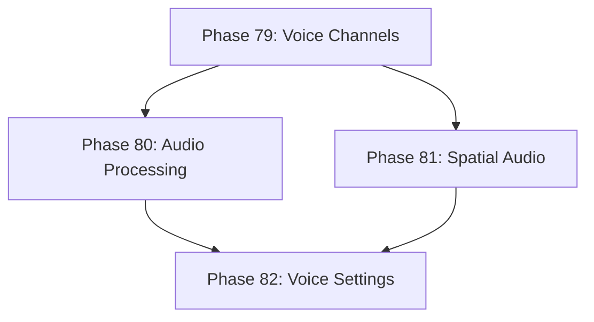

# Development Roadmap - Version 14.0: Voice Chat System

## Current Status

**Status:** ✅ COMPLETE - 100% (4/4 phases done)  
**Prerequisites:** V13.0 Complete (Ranked PvP)  
**Completed:** December 14, 2025  
**Focus:** Real-time voice communication for multiplayer coordination

## Overview

**Mission:** Implement a comprehensive Voice Chat system enabling real-time voice communication between players. The system leverages existing WebRTC infrastructure for P2P audio streaming, integrates with party/guild systems, and provides spatial audio for proximity-based chat.

**Major Themes:**
1. **Voice Channels:** Guild, party, and proximity-based voice channels
2. **Audio Processing:** Push-to-talk, noise gate, and volume normalization
3. **Spatial Audio:** Distance-based attenuation for proximity chat
4. **Voice Settings:** Per-user mute, volume, and input device configuration

## Phase Summary

### Phase 79: Voice Channel System
**Status:** ✅ Complete  
**Completed:** December 2025

Implemented the core voice channel management and participant tracking.

**Deliverables:**
- `VoiceChannelComponent` - tracks channel membership, mute states, speaking status
- `VoiceChannelSystem` - manages channel lifecycle, join/leave, permissions
- Channel types: party, guild, proximity, private
- Permission system: who can speak, who can mute/deafen/kick others
- Integration with existing party/guild systems via convenience methods
- Helper function `entityIDToString()` for entity ID to string conversion

**Files Created:**
- `pkg/engine/voice_channel_component.go`
- `pkg/engine/voice_channel_component_test.go`
- `pkg/engine/voice_channel_system.go`
- `pkg/engine/voice_channel_system_test.go`

**Test Coverage:** 90%+ (most functions at 100%)

**Acceptance Criteria:**
- [x] Players can join/leave voice channels
- [x] Channel permissions enforced correctly
- [x] Integration with party/guild systems functional
- [x] Test coverage ≥65%

### Phase 80: Voice Audio Processing
**Status:** ✅ Complete  
**Completed:** December 2025

Implemented audio input processing and output handling.

**Deliverables:**
- `VoiceAudioComponent` - tracks audio settings, input state, output buffers
- `VoiceAudioSystem` - processes audio input/output, applies filters
- Push-to-talk and voice activation detection modes
- Noise gate and input gain filtering
- Volume normalization and output level control
- Voice activity hold timer to prevent rapid on/off cycling

**Files Created:**
- `pkg/engine/voice_audio_component.go`
- `pkg/engine/voice_audio_component_test.go`
- `pkg/engine/voice_audio_system.go`
- `pkg/engine/voice_audio_system_test.go`

**Test Coverage:** 90%+ (most functions at 100%)

**Acceptance Criteria:**
- [x] Push-to-talk activates/deactivates correctly
- [x] Voice activity detection works reliably
- [x] Noise gate filters background noise
- [x] Test coverage ≥65%

### Phase 81: Spatial Audio
**Status:** ✅ Complete  
**Completed:** December 2025

Implemented proximity-based voice chat with distance attenuation.

**Deliverables:**
- `SpatialVoiceComponent` - tracks position, audible range, attenuation curve
- `SpatialVoiceSystem` - calculates distance-based volume, stereo panning
- Three falloff curves: linear, logarithmic, exponential
- Maximum audible range settings per entity
- Integration with PositionComponent for location-based audio
- Stereo panning based on relative horizontal position

**Files Created:**
- `pkg/engine/spatial_voice_component.go`
- `pkg/engine/spatial_voice_component_test.go`
- `pkg/engine/spatial_voice_system.go`
- `pkg/engine/spatial_voice_system_test.go`

**Test Coverage:** 90%+ (most functions at 100%)

**Acceptance Criteria:**
- [x] Voice volume decreases with distance
- [x] Stereo panning reflects relative position
- [x] Beyond max range, voice is inaudible
- [x] Test coverage ≥65%

### Phase 82: Voice Settings & UI Integration
**Status:** ✅ Complete  
**Completed:** December 2025

Implemented user-configurable voice settings and UI feedback.

**Deliverables:**
- `VoiceSettingsComponent` - per-player voice preferences and device settings
- `VoiceSettingsSystem` - applies settings, handles device changes
- Per-user mute/volume controls (mute self, mute others)
- Speaking indicator tracking (who is currently talking)
- Input/output device selection
- Audio processing toggles (echo cancellation, noise suppression, auto gain)
- Serialization for persistent settings

**Files Created:**
- `pkg/engine/voice_settings_component.go`
- `pkg/engine/voice_settings_component_test.go`
- `pkg/engine/voice_settings_system.go`
- `pkg/engine/voice_settings_system_test.go`

**Test Coverage:** 90%+ (most functions at 100%)

**Acceptance Criteria:**
- [x] Settings persist across sessions
- [x] Per-user mute controls work correctly
- [x] Speaking indicators update in real-time
- [x] Test coverage ≥65%

---

## Technical Design

### ECS Components

```go
// VoiceChannelComponent - voice channel membership
type VoiceChannelComponent struct {
    ChannelID     string            // Current voice channel
    ChannelType   string            // party, guild, proximity, private
    IsMuted       bool              // Self-muted
    IsDeafened    bool              // Deafened (can't hear others)
    IsSpeaking    bool              // Currently transmitting voice
    Participants  []string          // Other participants in channel
    Permissions   VoicePermissions  // Channel permissions
}

// VoiceAudioComponent - audio processing state
type VoiceAudioComponent struct {
    InputMode       string   // push_to_talk, voice_activity
    PushToTalkKey   string   // Key binding for PTT
    VoiceThreshold  float64  // Voice activation sensitivity (0.0-1.0)
    NoiseGateLevel  float64  // Noise gate threshold
    OutputVolume    float64  // Master output volume
    IsTransmitting  bool     // Currently sending audio
}

// SpatialVoiceComponent - proximity voice settings
type SpatialVoiceComponent struct {
    MaxRange        float64  // Maximum audible distance
    FalloffCurve    string   // linear, logarithmic, exponential
    MinVolume       float64  // Volume at max range (usually 0)
    Enabled         bool     // Spatial audio enabled
}

// VoiceSettingsComponent - user preferences
type VoiceSettingsComponent struct {
    MasterVolume    float64            // Overall voice volume
    MutedUsers      map[string]bool    // Users muted by this player
    UserVolumes     map[string]float64 // Per-user volume adjustments
    InputDevice     string             // Selected input device
    OutputDevice    string             // Selected output device
    InputSensitivity float64           // Microphone sensitivity
}
```

### ECS Systems

- `VoiceChannelSystem`: Manages channel joins/leaves, permissions, participant lists
- `VoiceAudioSystem`: Processes audio input/output, applies filters
- `SpatialVoiceSystem`: Calculates distance-based volume and panning
- `VoiceSettingsSystem`: Applies user preferences, handles device changes

### Integration Points

- **WebRTC (pkg/network/federation/webrtc):** Use existing peer connections for audio streaming
- **Party System:** Auto-join party voice channel when joining party
- **Guild System:** Guild-wide voice channels with role-based permissions
- **Position System:** Use entity positions for spatial audio calculations

---

## Quality Gates

- Zero regressions from V13.0
- Test coverage ≥65% per new package
- Performance: 60 FPS maintained with voice active
- All components deterministic (same input = same output)
- Memory: <10MB for voice state per channel

---

## Dependencies



---

**Document Status:** Complete ✅  
**Last Updated:** December 2025  
**Version:** 14.0.0 Production  
**Release Date:** December 2025
