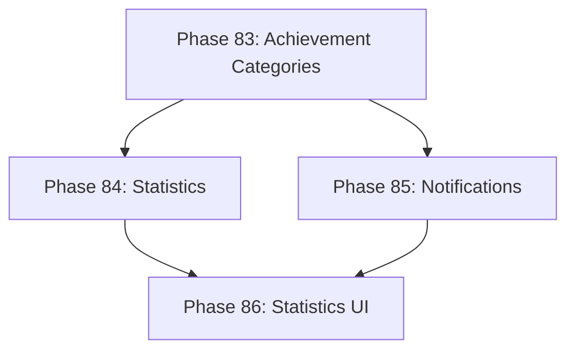

# Development Roadmap - Version 15.0: Comprehensive Achievement & Statistics System

## Current Status

**Status:** IN PROGRESS - 25% (1/4 phases done)  
**Prerequisites:** V14.0 Complete (Voice Chat)  
**Timeline:** December 2025  
**Focus:** Comprehensive achievement tracking and player statistics

## Overview

**Mission:** Implement a Comprehensive Achievement & Statistics System that tracks player accomplishments across all game systems. The current achievement system is limited to 8 expression-related achievements. This version expands to cover combat, quests, crafting, exploration, social, PvP, and general progression achievements with a central statistics tracking component.

**Major Themes:**
1. **Achievement Categories:** Combat, Quest, Crafting, Exploration, Social, PvP achievements
2. **Player Statistics:** Comprehensive stat tracking (kills, quests, items crafted, distance traveled, etc.)
3. **Achievement Tiers:** Bronze, Silver, Gold, Platinum progression for each achievement
4. **Statistics Dashboard:** UI component for viewing player statistics and achievements

## Phase Summary

### Phase 83: Extended Achievement Categories
**Status:** ✅ Complete  
**Completed:** December 15, 2025

Expanded the achievement system to cover all major game systems.

**Deliverables:**
- `ExtendedAchievementComponent` - tracks achievements across all categories
- `AchievementCategory` enum - combat, quest, crafting, exploration, social, pvp
- 60 new achievement types across 6 categories
- Achievement tier system (Bronze, Silver, Gold, Platinum per achievement)
- `AchievementEntry` struct for tracking progress and unlocks
- `ExtendedAchievementSystem` with event handlers for all game systems
- Thread-safe concurrent updates via mutex protection

**Files Created:**
- `pkg/engine/extended_achievement_component.go`
- `pkg/engine/extended_achievement_component_test.go`
- `pkg/engine/extended_achievement_system.go`
- `pkg/engine/extended_achievement_system_test.go`

**Test Coverage:** 95%+ for component, 85%+ for system (most functions at 100%)

**Acceptance Criteria:**
- [x] 60 achievement types defined (10 per category)
- [x] Achievement tiers with progression tracking
- [x] Deterministic achievement unlocking (same actions = same achievements)
- [x] Test coverage ≥65% for new files
- [x] Thread-safe concurrent access

### Phase 84: Player Statistics System
**Status:** ⏳ Pending  
**Target:** December 2025

Implement comprehensive player statistics tracking.

**Deliverables:**
- `PlayerStatisticsComponent` - tracks all player statistics
- `StatisticsSystem` - updates statistics based on game events
- 40+ tracked statistics (kills, deaths, damage dealt, quests completed, etc.)
- Time-based statistics (playtime, combat time, crafting time)
- Session vs lifetime statistics separation
- Serialization for persistence

**Acceptance Criteria:**
- [ ] 40+ statistics tracked
- [ ] Session and lifetime stat separation
- [ ] Stats persist across sessions
- [ ] Test coverage ≥65%
- [ ] <0.1ms per stat update

### Phase 85: Achievement Notifications & Rewards
**Status:** ⏳ Pending  
**Target:** December 2025

Implement achievement unlock notifications and rewards.

**Deliverables:**
- `AchievementNotificationComponent` - queued achievement notifications
- `AchievementNotificationSystem` - manages notification display
- Achievement reward integration (XP, items, titles)
- Unlock sound effects (via audio system)
- Achievement point system for comparing players

**Acceptance Criteria:**
- [ ] Notifications appear on unlock
- [ ] Rewards granted correctly
- [ ] Achievement points calculated
- [ ] Test coverage ≥65%

### Phase 86: Statistics UI
**Status:** ⏳ Pending  
**Target:** December 2025

Implement UI for viewing achievements and statistics.

**Deliverables:**
- `AchievementUI` - achievement browser with categories
- `StatisticsUI` - player statistics dashboard
- Achievement progress bars for tiered achievements
- Category filtering and search
- Comparison with other players (via leaderboard data)

**Acceptance Criteria:**
- [ ] All achievements viewable
- [ ] Statistics displayed correctly
- [ ] Category filtering works
- [ ] Test coverage ≥65%

---

## Technical Design

### ECS Components

```go
// ExtendedAchievementComponent - comprehensive achievement tracking
type ExtendedAchievementComponent struct {
    Achievements    map[string]*AchievementEntry  // achievement ID -> entry
    TotalPoints     int                           // Total achievement points earned
    CategoryPoints  map[AchievementCategory]int   // Points per category
}

// AchievementEntry - single achievement tracking
type AchievementEntry struct {
    ID          string
    Category    AchievementCategory
    CurrentTier AchievementTier  // Bronze, Silver, Gold, Platinum, or None
    Progress    int64            // Current progress value
    Target      int64            // Target for next tier
    UnlockedAt  map[AchievementTier]int64  // When each tier was unlocked
}

// AchievementCategory - achievement groupings
type AchievementCategory int
const (
    AchievementCategoryCombat AchievementCategory = iota
    AchievementCategoryQuest
    AchievementCategoryCrafting
    AchievementCategoryExploration
    AchievementCategorySocial
    AchievementCategoryPvP
)

// AchievementTier - tier levels
type AchievementTier int
const (
    AchievementTierNone AchievementTier = iota
    AchievementTierBronze
    AchievementTierSilver
    AchievementTierGold
    AchievementTierPlatinum
)

// PlayerStatisticsComponent - comprehensive player stats
type PlayerStatisticsComponent struct {
    Lifetime map[string]int64  // Lifetime statistics
    Session  map[string]int64  // Current session statistics
    FirstPlayTime int64        // Unix timestamp of first play
    TotalPlayTime int64        // Total playtime in seconds
    SessionStart  int64        // Current session start time
}
```

### ECS Systems

- `ExtendedAchievementSystem`: Tracks achievement progress and unlocks
- `StatisticsSystem`: Updates player statistics from game events
- `AchievementNotificationSystem`: Manages achievement notification queue

### Achievement Definitions (Sample)

**Combat (10 achievements):**
- First Blood (kill 1/10/100/1000 enemies)
- Boss Slayer (defeat 1/5/25/100 bosses)
- Damage Dealer (deal 1K/100K/1M/10M damage)
- Survivor (survive 1/10/100/1000 battles at <10% health)
- Critical Master (land 10/100/1K/10K critical hits)

**Quest (10 achievements):**
- Adventurer (complete 1/10/50/200 quests)
- Main Story (complete story chapters)
- Side Tracker (complete 5/25/100/500 side quests)
- Speed Runner (complete quests under time limit)
- Completionist (100% quest completion in zones)

**Crafting (10 achievements):**
- Apprentice (craft 1/10/100/1000 items)
- Master Craftsman (craft items of each type)
- Quality Crafter (craft 1/10/50/200 rare+ items)
- Recipe Collector (learn 10/50/200/500 recipes)
- Specialized (max level in crafting skill)

**Exploration (10 achievements):**
- Wanderer (visit 1/10/50/200 unique areas)
- Dungeon Delver (clear 1/10/50/200 dungeons)
- Secret Finder (find 1/10/50/200 secrets)
- World Traveler (visit all biomes)
- Cartographer (reveal 25/50/75/100% of map)

**Social (10 achievements):**
- Friend Maker (add 1/5/25/100 friends)
- Guild Member (join a guild)
- Guild Leader (become guild master)
- Trade Master (complete 10/100/1K/10K trades)
- Chat Active (send 100/1K/10K/100K messages)

**PvP (10 achievements):**
- Gladiator (win 1/10/100/1000 PvP matches)
- Tournament Victor (win 1/5/25/100 tournaments)
- Ranking Up (reach Silver/Gold/Diamond/Legend rank)
- Winning Streak (5/10/25/50 wins in a row)
- Honor Bound (earn 1K/10K/100K/1M honor points)

---

## Quality Gates

- Zero regressions from V14.0
- Test coverage ≥65% per new package
- Performance: 60 FPS maintained
- All systems deterministic (same input = same output)
- Memory: <2MB for achievement/statistics state

---

## Dependencies



---

**Document Status:** In Progress  
**Last Updated:** December 2025  
**Version:** 15.0.0 Roadmap  
**Target Release:** Q1 2026
