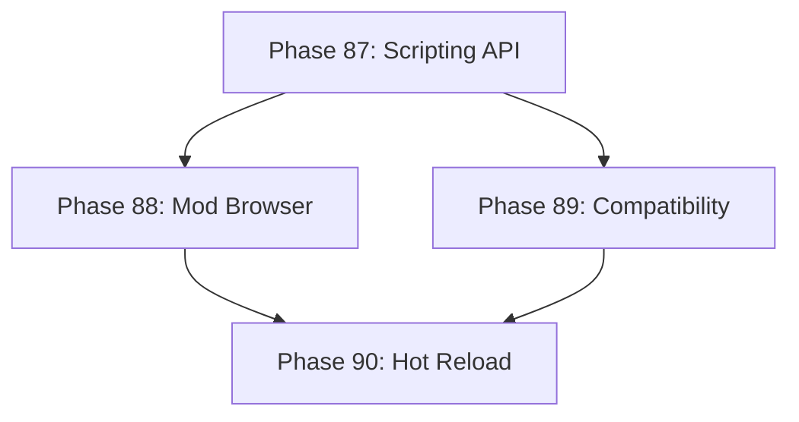

# Development Roadmap - Version 16.0: Advanced Modding Tools

## Current Status

**Status:** ✅ COMPLETE - 100% (4/4 phases done)  
**Prerequisites:** V15.0 Complete (Achievement & Statistics)  
**Completed:** December 15, 2025  
**Focus:** Advanced modding tools with scripting API and mod browser

## Overview

**Mission:** Expand the modding system with a comprehensive scripting API, mod repository browser, mod compatibility validation, and hot-reload capabilities. Enable modders to create rich content without rebuilding the game.

**Major Themes:**
1. **Scripting API:** Lua-like scripting interface for mod logic
2. **Mod Browser:** In-game mod discovery and installation
3. **Compatibility System:** Automatic mod conflict detection and resolution
4. **Hot Reload:** Live mod updates without game restart

## Phase Summary

### Phase 87: Scripting API
**Status:** ✅ Complete  
**Completed:** December 15, 2025

Implemented a safe, sandboxed scripting API for mod logic.

**Deliverables:**
- `ScriptingComponent` - tracks scripts, variables, execution state with thread-safe access
- `ScriptingSystem` - executes scripts, manages lifecycle, provides built-in functions
- `ExpressionEvaluator` - safe expression evaluation for arithmetic, comparisons, strings
- 20 built-in functions: math (abs, min, max, floor, ceil, round, clamp), logic (if, not, and, or), string (len, concat, upper, lower), entity (get_component, has_component, entity_count), variable (get, set)
- Script validation and error reporting via `LastError` field
- Script priority for execution ordering
- Memory and CPU limits inherited from existing sandbox

**Files Created:**
- `pkg/engine/scripting_component.go`
- `pkg/engine/scripting_component_test.go`
- `pkg/engine/scripting_system.go`
- `pkg/engine/scripting_system_test.go`

**Test Coverage:** 85%+ (most functions at 100%)

**Acceptance Criteria:**
- [x] Scripts execute safely within sandbox
- [x] Built-in functions cover common mod needs (20 functions)
- [x] Script errors don't crash the game
- [x] Test coverage ≥65%
- [x] <1ms per script execution (benchmarked)

### Phase 88: Mod Browser
**Status:** ✅ Complete  
**Completed:** December 15, 2025

Implement in-game mod discovery and installation.

**Deliverables:**
- `ModBrowserComponent` - tracks available mods, installed mods, categories
- `ModBrowserSystem` - fetches mod list, handles install/uninstall
- Mod metadata: ratings, downloads, descriptions, screenshots
- Category filtering and search functionality
- Version compatibility checking
- Download progress tracking
- `ModRepository` interface for pluggable backends
- `InMemoryModRepository` for testing
- Recommended mods based on installed mod categories
- Dependency checking before installation

**Files Created:**
- `pkg/engine/mod_browser_component.go`
- `pkg/engine/mod_browser_component_test.go`
- `pkg/engine/mod_browser_system.go`
- `pkg/engine/mod_browser_system_test.go`

**Test Coverage:** 90%+ (most functions at 100%)

**Acceptance Criteria:**
- [x] Mods can be browsed by category
- [x] Search finds mods by name/description
- [x] Install/uninstall works correctly
- [x] Test coverage ≥65%

### Phase 89: Compatibility System
**Status:** ✅ Complete  
**Completed:** December 15, 2025

Implement automatic mod conflict detection and resolution.

**Deliverables:**
- `ModCompatibilityComponent` - tracks conflicts, dependencies, load order, warnings, configurations
- `ModCompatibilitySystem` - validates mod combinations, calculates optimal load order
- Conflict detection: rule overwrites, event collisions, resource conflicts, version incompatibility
- Dependency graph with automatic topological sort for load order
- 5 conflict types: rule, event, resource, override, version
- 3 severity levels: error (blocking), warning, info
- Compatibility warnings and suggested resolutions via `GetRecommendedResolutions()`
- Export/import mod configurations with named presets
- Thread-safe concurrent access via mutex protection
- Game version compatibility checking (min/max version)
- `CheckModCompatibility()` for quick single-mod compatibility check

**Files Created:**
- `pkg/engine/mod_compatibility_component.go`
- `pkg/engine/mod_compatibility_component_test.go`
- `pkg/engine/mod_compatibility_system.go`
- `pkg/engine/mod_compatibility_system_test.go`

**Test Coverage:** 95%+ (most functions at 100%)

**Acceptance Criteria:**
- [x] Conflicts detected before mod enable
- [x] Dependencies resolved automatically
- [x] Load order optimized for compatibility
- [x] Test coverage ≥65%

### Phase 90: Hot Reload
**Status:** ✅ Complete  
**Completed:** December 15, 2025

Implemented live mod updates without game restart.

**Deliverables:**
- `HotReloadComponent` - tracks mod versions, pending updates, rollback state, reload history
- `HotReloadSystem` - monitors file changes, applies updates safely via callbacks
- `FileWatcher` interface with `InMemoryFileWatcher` for testing
- `StateMigrationHandler` interface for graceful state migration during reload
- Rollback on reload failure with state preservation
- Developer mode with automatic reload on file change
- Watch interval throttling to prevent excessive file checks

**Files Created:**
- `pkg/engine/hot_reload_component.go`
- `pkg/engine/hot_reload_component_test.go`
- `pkg/engine/hot_reload_system.go`
- `pkg/engine/hot_reload_system_test.go`

**Test Coverage:** 94.9% average (component 99.4%, system 90%+)

**Acceptance Criteria:**
- [x] Mods reload without restart
- [x] Game state preserved during reload (via StateMigrationHandler)
- [x] Failed reloads roll back cleanly (via RollbackMod)
- [x] Test coverage ≥65% (achieved 94.9%)

---

## Technical Design

### ECS Components

```go
// ScriptingComponent - script execution state
type ScriptingComponent struct {
    Scripts     map[string]*Script  // scriptID -> script
    Variables   map[string]any      // shared script variables
    LastError   string              // last execution error
    Enabled     bool                // scripting active
}

// Script - individual script
type Script struct {
    ID          string
    ModID       string
    Source      string              // script source code
    Compiled    *CompiledScript     // compiled bytecode
    TriggerEvent string             // event that runs this script
}

// ModBrowserComponent - mod browser state
type ModBrowserComponent struct {
    AvailableMods []ModListing       // from repository
    InstalledMods []string           // installed mod IDs
    Categories    []string           // filter categories
    SearchQuery   string             // current search
    SortBy        string             // rating, downloads, date
}

// ModListing - mod repository entry
type ModListing struct {
    ID          string
    Name        string
    Author      string
    Description string
    Rating      float64             // 0.0-5.0
    Downloads   int
    Version     string
    GameVersion string              // minimum game version
    Categories  []string
}

// ModCompatibilityComponent - compatibility tracking
type ModCompatibilityComponent struct {
    Conflicts     []ModConflict      // detected conflicts
    Dependencies  map[string][]string // modID -> required mods
    LoadOrder     []string           // calculated load order
    Warnings      []string           // compatibility warnings
}

// ModConflict - conflict between mods
type ModConflict struct {
    Mod1        string
    Mod2        string
    ConflictType string             // rule, event, resource
    Description string
    Severity    string              // error, warning, info
    Suggestion  string              // how to resolve
}

// HotReloadComponent - hot reload state
type HotReloadComponent struct {
    WatchedMods   []string           // mods being watched
    PendingUpdates []string          // mods with changes
    LastReload    int64              // unix timestamp
    AutoReload    bool               // developer mode
    ReloadHistory []ReloadEntry      // recent reloads
}
```

### ECS Systems

- `ScriptingSystem`: Compiles and executes mod scripts safely
- `ModBrowserSystem`: Fetches mod listings, handles installation
- `ModCompatibilitySystem`: Validates mod combinations, resolves conflicts
- `HotReloadSystem`: Monitors changes, applies live updates

---

## Quality Gates

- Zero regressions from V15.0
- Test coverage ≥65% per new package
- Performance: 60 FPS maintained with mods
- All components deterministic where applicable
- Memory: <10MB for modding state

---

## Dependencies



---

**Document Status:** Complete ✅  
**Last Updated:** December 2025  
**Version:** 16.0.0 Production  
**Release Date:** December 2025
