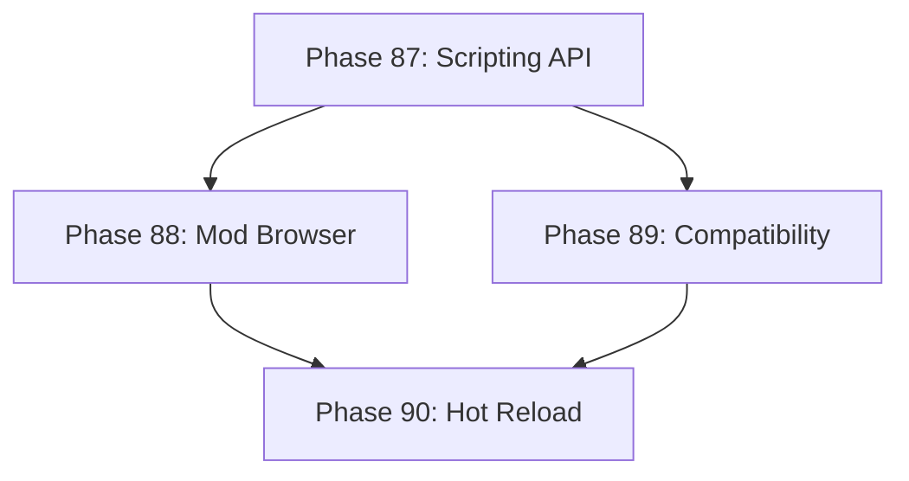

# Development Roadmap - Version 16.0: Advanced Modding Tools

## Current Status

**Status:** IN PROGRESS - 25% (1/4 phases done)  
**Prerequisites:** V15.0 Complete (Achievement & Statistics)  
**Timeline:** December 2025  
**Focus:** Advanced modding tools with scripting API and mod browser

## Overview

**Mission:** Expand the modding system with a comprehensive scripting API, mod repository browser, mod compatibility validation, and hot-reload capabilities. Enable modders to create rich content without rebuilding the game.

**Major Themes:**
1. **Scripting API:** Lua-like scripting interface for mod logic
2. **Mod Browser:** In-game mod discovery and installation
3. **Compatibility System:** Automatic mod conflict detection and resolution
4. **Hot Reload:** Live mod updates without game restart

## Phase Summary

### Phase 87: Scripting API
**Status:** ✅ Complete  
**Completed:** December 15, 2025

Implemented a safe, sandboxed scripting API for mod logic.

**Deliverables:**
- `ScriptingComponent` - tracks scripts, variables, execution state with thread-safe access
- `ScriptingSystem` - executes scripts, manages lifecycle, provides built-in functions
- `ExpressionEvaluator` - safe expression evaluation for arithmetic, comparisons, strings
- 20 built-in functions: math (abs, min, max, floor, ceil, round, clamp), logic (if, not, and, or), string (len, concat, upper, lower), entity (get_component, has_component, entity_count), variable (get, set)
- Script validation and error reporting via `LastError` field
- Script priority for execution ordering
- Memory and CPU limits inherited from existing sandbox

**Files Created:**
- `pkg/engine/scripting_component.go`
- `pkg/engine/scripting_component_test.go`
- `pkg/engine/scripting_system.go`
- `pkg/engine/scripting_system_test.go`

**Test Coverage:** 85%+ (most functions at 100%)

**Acceptance Criteria:**
- [x] Scripts execute safely within sandbox
- [x] Built-in functions cover common mod needs (20 functions)
- [x] Script errors don't crash the game
- [x] Test coverage ≥65%
- [x] <1ms per script execution (benchmarked)

### Phase 88: Mod Browser
**Status:** ⏳ Not Started  
**Target:** December 2025

Implement in-game mod discovery and installation.

**Deliverables:**
- `ModBrowserComponent` - tracks available mods, installed mods, categories
- `ModBrowserSystem` - fetches mod list, handles install/uninstall
- Mod metadata: ratings, downloads, descriptions, screenshots
- Category filtering and search functionality
- Version compatibility checking
- Download progress tracking

**Acceptance Criteria:**
- [ ] Mods can be browsed by category
- [ ] Search finds mods by name/description
- [ ] Install/uninstall works correctly
- [ ] Test coverage ≥65%

### Phase 89: Compatibility System
**Status:** ⏳ Not Started  
**Target:** December 2025

Implement automatic mod conflict detection and resolution.

**Deliverables:**
- `ModCompatibilityComponent` - tracks conflicts, dependencies, load order
- `ModCompatibilitySystem` - validates mod combinations, suggests fixes
- Conflict detection: rule overwrites, event collisions, resource conflicts
- Dependency graph with automatic load order calculation
- Compatibility warnings and suggested resolutions
- Export/import mod configurations

**Acceptance Criteria:**
- [ ] Conflicts detected before mod enable
- [ ] Dependencies resolved automatically
- [ ] Load order optimized for compatibility
- [ ] Test coverage ≥65%

### Phase 90: Hot Reload
**Status:** ⏳ Not Started  
**Target:** December 2025

Implement live mod updates without game restart.

**Deliverables:**
- `HotReloadComponent` - tracks mod versions, pending updates
- `HotReloadSystem` - monitors file changes, applies updates safely
- File watcher for mod directory changes
- Graceful state migration during reload
- Rollback on reload failure
- Developer mode with automatic reload

**Acceptance Criteria:**
- [ ] Mods reload without restart
- [ ] Game state preserved during reload
- [ ] Failed reloads roll back cleanly
- [ ] Test coverage ≥65%

---

## Technical Design

### ECS Components

```go
// ScriptingComponent - script execution state
type ScriptingComponent struct {
    Scripts     map[string]*Script  // scriptID -> script
    Variables   map[string]any      // shared script variables
    LastError   string              // last execution error
    Enabled     bool                // scripting active
}

// Script - individual script
type Script struct {
    ID          string
    ModID       string
    Source      string              // script source code
    Compiled    *CompiledScript     // compiled bytecode
    TriggerEvent string             // event that runs this script
}

// ModBrowserComponent - mod browser state
type ModBrowserComponent struct {
    AvailableMods []ModListing       // from repository
    InstalledMods []string           // installed mod IDs
    Categories    []string           // filter categories
    SearchQuery   string             // current search
    SortBy        string             // rating, downloads, date
}

// ModListing - mod repository entry
type ModListing struct {
    ID          string
    Name        string
    Author      string
    Description string
    Rating      float64             // 0.0-5.0
    Downloads   int
    Version     string
    GameVersion string              // minimum game version
    Categories  []string
}

// ModCompatibilityComponent - compatibility tracking
type ModCompatibilityComponent struct {
    Conflicts     []ModConflict      // detected conflicts
    Dependencies  map[string][]string // modID -> required mods
    LoadOrder     []string           // calculated load order
    Warnings      []string           // compatibility warnings
}

// ModConflict - conflict between mods
type ModConflict struct {
    Mod1        string
    Mod2        string
    ConflictType string             // rule, event, resource
    Description string
    Severity    string              // error, warning, info
    Suggestion  string              // how to resolve
}

// HotReloadComponent - hot reload state
type HotReloadComponent struct {
    WatchedMods   []string           // mods being watched
    PendingUpdates []string          // mods with changes
    LastReload    int64              // unix timestamp
    AutoReload    bool               // developer mode
    ReloadHistory []ReloadEntry      // recent reloads
}
```

### ECS Systems

- `ScriptingSystem`: Compiles and executes mod scripts safely
- `ModBrowserSystem`: Fetches mod listings, handles installation
- `ModCompatibilitySystem`: Validates mod combinations, resolves conflicts
- `HotReloadSystem`: Monitors changes, applies live updates

---

## Quality Gates

- Zero regressions from V15.0
- Test coverage ≥65% per new package
- Performance: 60 FPS maintained with mods
- All components deterministic where applicable
- Memory: <10MB for modding state

---

## Dependencies



---

**Document Status:** In Progress  
**Last Updated:** December 2025  
**Version:** 16.0.0 Roadmap  
**Target Release:** Q1 2026
