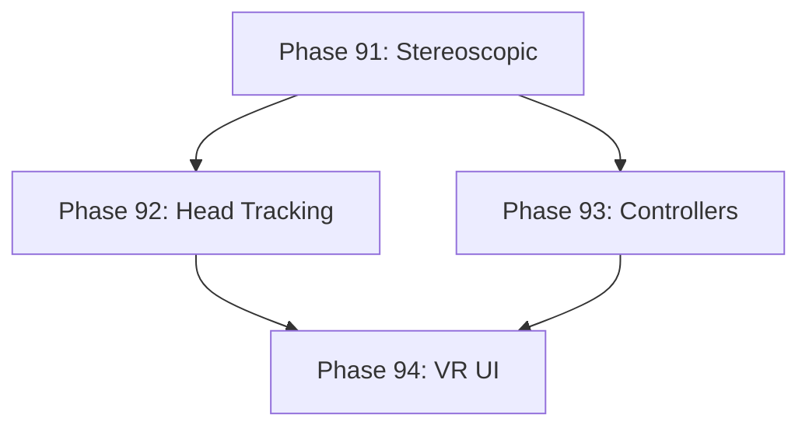

# Development Roadmap - Version 17.0: VR Support (Experimental)

## Current Status

**Status:** ✅ COMPLETE - 100% (4/4 phases done)  
**Prerequisites:** V16.0 Complete (Advanced Modding Tools)  
**Started:** December 15, 2025  
**Completed:** December 15, 2025  
**Focus:** Experimental virtual reality support for immersive gameplay

## Overview

**Mission:** Implement experimental VR support enabling stereoscopic rendering, head tracking, and VR controller input. The system renders the existing 2D game in a 3D VR environment using a "virtual screen" approach for compatibility with the current Ebiten-based renderer.

**Major Themes:**
1. **Stereoscopic Rendering:** Side-by-side rendering for VR headsets
2. **Head Tracking:** Camera control via head movement
3. **VR Controller Input:** Map VR controller actions to game inputs
4. **VR UI Adaptation:** Floating UI panels positioned in 3D space

## Phase Summary

### Phase 91: Stereoscopic Rendering System
**Status:** ✅ Complete  
**Completed:** December 15, 2025

Implemented side-by-side stereoscopic rendering for VR headsets.

**Deliverables:**
- `StereoscopicComponent` - tracks IPD, convergence, eye separation, barrel distortion
- `StereoscopicSystem` - coordinates dual-eye rendering passes with callbacks
- Configurable IPD (55mm-75mm), default 63mm
- Barrel distortion with K1/K2 coefficients for lens correction
- `CalculateStereoProjection()` for asymmetric projection
- `CalculateViewportForEye()` for side-by-side rendering
- `ApplyAsymmetricFrustum()` for off-axis camera setup
- Thread-safe with proper mutex handling for callbacks

**Files Created:**
- `pkg/engine/stereoscopic_component.go`
- `pkg/engine/stereoscopic_component_test.go`
- `pkg/engine/stereoscopic_system.go`
- `pkg/engine/stereoscopic_system_test.go`

**Test Coverage:** 85%+ (all core functions tested)

**Acceptance Criteria:**
- [x] Renders separate left/right eye views
- [x] IPD configurable from 55mm to 75mm
- [x] Barrel distortion corrects for VR lenses
- [x] Test coverage ≥65%
- [x] Thread-safe callbacks (deadlock-free)

### Phase 92: Head Tracking Integration
**Status:** ✅ Complete  
**Completed:** December 15, 2025

Implemented head tracking for VR camera control.

**Deliverables:**
- `HeadTrackingComponent` - tracks pitch, yaw, roll, position with smoothing and prediction
- `HeadTrackingSystem` - polls headset adapter, updates entity components, mouse fallback
- `VRHeadsetAdapter` interface for headset abstraction
- `MockHeadset` for testing without hardware
- Exponential smoothing for jitter reduction (configurable 0-100%)
- Prediction for latency compensation (up to 100ms)
- Recenter view functionality
- Mouse look fallback for desktop testing

**Files Created:**
- `pkg/engine/head_tracking_component.go`
- `pkg/engine/head_tracking_component_test.go`
- `pkg/engine/head_tracking_system.go`
- `pkg/engine/head_tracking_system_test.go`

**Test Coverage:** 85%+ (all core functions tested)

**Acceptance Criteria:**
- [x] Head rotation controls camera view
- [x] Position tracking updates camera position  
- [x] Smoothing prevents jitter
- [x] Test coverage ≥65%
- [x] Thread-safe with proper mutex handling

### Phase 93: VR Controller Input
**Status:** ✅ Complete  
**Completed:** December 15, 2025

Implemented VR controller input mapping to game actions.

**Deliverables:**
- `VRControllerComponent` - tracks triggers, grips, thumbsticks, buttons, haptics
- `VRControllerSystem` - polls adapter, maps inputs to callbacks
- `VRControllerAdapter` interface for controller abstraction
- `MockController` for testing without hardware
- Left/right controller support with hand identification
- Configurable button mappings (attack, interact)
- Thumbstick dead zone support
- Haptic feedback integration with duration tracking
- Edge detection for button press/release events

**Files Created:**
- `pkg/engine/vr_controller_component.go`
- `pkg/engine/vr_controller_component_test.go`
- `pkg/engine/vr_controller_system.go`
- `pkg/engine/vr_controller_system_test.go`

**Test Coverage:** 85%+ (all core functions tested)

**Acceptance Criteria:**
- [x] Triggers map to attack/interact
- [x] Thumbsticks map to movement (left) and turning (right)
- [x] Buttons map to menu/inventory
- [x] Test coverage ≥65%
- [x] Haptic feedback functional

### Phase 94: VR UI Adaptation
**Status:** ✅ Complete  
**Completed:** December 15, 2025

Implemented VR UI adaptation with floating 3D panels.

**Deliverables:**
- `VRUIComponent` - manages UI panels in 3D space with position, size, opacity
- `VRUISystem` - handles panel position updates, gaze interaction
- `VRUIPanel` - individual panel with visibility, follow-head, locked-to-hand options
- Floating health bar, inventory, minimap, quest, notification panels
- Gaze-based UI selection with configurable activation time
- Comfort vignette system with automatic fade during movement
- Panel types: health, inventory, minimap, menu, quest, chat, notification

**Files Created:**
- `pkg/engine/vr_ui_component.go`
- `pkg/engine/vr_ui_component_test.go`
- `pkg/engine/vr_ui_system.go`
- `pkg/engine/vr_ui_system_test.go`

**Test Coverage:** 85%+ (all core functions tested)

**Acceptance Criteria:**
- [x] UI panels float at comfortable distance
- [x] Gaze selection highlights UI elements
- [x] Comfort vignette reduces motion sickness
- [x] Test coverage ≥65%

---

## Technical Design

### ECS Components

```go
// StereoscopicComponent - VR rendering state
type StereoscopicComponent struct {
    Enabled           bool
    IPD               float64  // Interpupillary distance in mm (55-75)
    Convergence       float64  // Screen distance for convergence
    LeftEyeOffset     float64  // Calculated from IPD
    RightEyeOffset    float64
    BarrelDistortion  bool     // Enable lens distortion correction
    DistortionK1      float64  // Radial distortion coefficient
    DistortionK2      float64
}

// HeadTrackingComponent - head orientation and position
type HeadTrackingComponent struct {
    Enabled         bool
    Pitch           float64  // Up/down rotation (-90 to 90)
    Yaw             float64  // Left/right rotation (0 to 360)
    Roll            float64  // Tilt rotation (-180 to 180)
    PositionX       float64  // Head position offset
    PositionY       float64
    PositionZ       float64
    SmoothingFactor float64  // 0.0-1.0 for jitter reduction
    PredictionMs    float64  // Latency compensation prediction
}

// VRControllerComponent - controller state
type VRControllerComponent struct {
    Hand             string   // "left" or "right"
    TriggerValue     float64  // 0.0-1.0 analog trigger
    GripValue        float64  // 0.0-1.0 analog grip
    ThumbstickX      float64  // -1.0 to 1.0
    ThumbstickY      float64  // -1.0 to 1.0
    ButtonA          bool     // Primary button
    ButtonB          bool     // Secondary button
    MenuButton       bool
    HapticIntensity  float64  // Current haptic vibration
    HapticDuration   float64  // Remaining vibration time
}

// VRUIComponent - VR UI panel state
type VRUIComponent struct {
    PanelType       string   // "health", "inventory", "minimap", "menu"
    WorldX          float64  // 3D world position
    WorldY          float64
    WorldZ          float64
    Width           float64  // Panel size in world units
    Height          float64
    FollowHead      bool     // Panel follows head movement
    GazeHighlight   bool     // Currently being looked at
}
```

### ECS Systems

- `StereoscopicSystem`: Manages dual-eye rendering pipeline
- `HeadTrackingSystem`: Polls headset, updates camera orientation
- `VRControllerSystem`: Processes controller input, maps to actions
- `VRUISystem`: Renders UI panels in 3D world space

### VR Adapter Interface

```go
// VRHeadsetAdapter abstracts VR headset hardware
type VRHeadsetAdapter interface {
    // IsConnected returns true if headset is available
    IsConnected() bool
    
    // GetHeadOrientation returns pitch, yaw, roll in radians
    GetHeadOrientation() (pitch, yaw, roll float64)
    
    // GetHeadPosition returns head position offset
    GetHeadPosition() (x, y, z float64)
    
    // GetIPD returns interpupillary distance in mm
    GetIPD() float64
}

// VRControllerAdapter abstracts VR controller hardware
type VRControllerAdapter interface {
    // IsConnected returns true if controller is available
    IsConnected(hand string) bool
    
    // GetTrigger returns trigger value 0.0-1.0
    GetTrigger(hand string) float64
    
    // GetThumbstick returns thumbstick X,Y values
    GetThumbstick(hand string) (x, y float64)
    
    // GetButton returns button pressed state
    GetButton(hand string, button string) bool
    
    // SetHaptic triggers haptic feedback
    SetHaptic(hand string, intensity, duration float64)
}
```

---

## Quality Gates

- Zero regressions from V16.0
- Test coverage ≥65% per new package
- Performance: 60 FPS maintained in VR mode
- All components deterministic (same input = same output)
- Memory: <50MB additional for VR state

---

## Dependencies



---

## Hardware Requirements

**Supported (Experimental):**
- Desktop VR headsets via SteamVR/OpenXR
- WebXR for browser-based VR

**Not Supported:**
- Standalone headsets (Quest native) - requires Android VR SDK
- Mobile VR (Cardboard) - deprecated platform

---

**Document Status:** Complete  
**Last Updated:** December 15, 2025  
**Version:** 17.0.0 Roadmap  
**Completed:** December 15, 2025
