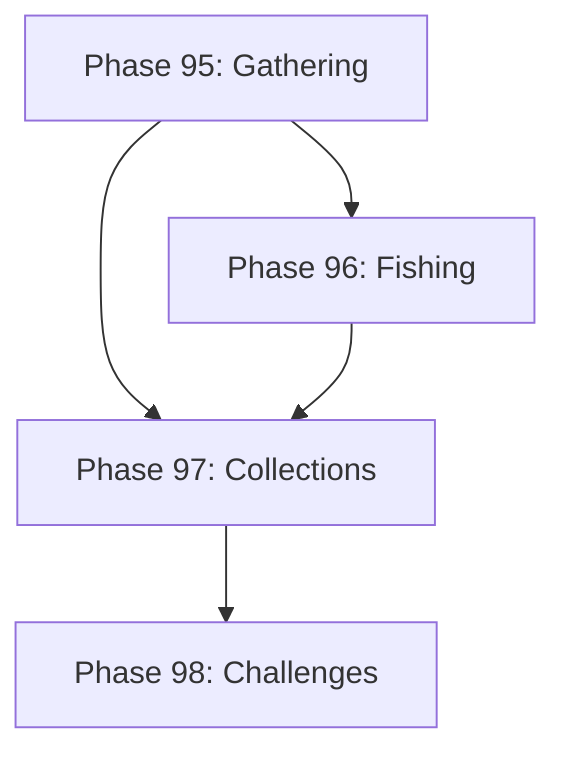

# Development Roadmap - Version 18.0: Gathering & Collection Systems

## Current Status

**Status:** IN PROGRESS - 75% (3/4 phases done)  
**Prerequisites:** V17.0 Complete (VR Support)  
**Started:** December 15, 2025  
**Focus:** Resource gathering, fishing, collections, and daily challenges

## Overview

**Mission:** Implement comprehensive gathering and collection systems to enhance gameplay variety. Add resource nodes for harvesting, fishing as a relaxing minigame, collectible tracking with rewards, and daily/weekly challenges for ongoing engagement.

**Major Themes:**
1. **Resource Gathering:** Procedural resource nodes with harvesting mechanics
2. **Fishing System:** Location-based fishing with fish types and minigame
3. **Collection System:** Collectibles, completion tracking, and rewards
4. **Daily Challenges:** Repeatable objectives with rotating rewards

## Phase Summary

### Phase 95: Resource Gathering System
**Status:** ✅ Complete

Implemented procedural resource nodes and harvesting mechanics.

**Deliverables:**
- ✅ `ResourceNodeComponent` - tracks resource type, quantity, respawn time
- ✅ `GatheringComponent` - player gathering skill, tool bonuses, active gathering
- ✅ `GatheringSystem` - processes harvesting, calculates yields, handles respawn
- ✅ Procedural resource node generation via `GenerateResourceNode()`
- ✅ 6 resource types: ore, wood, herb, gem, fiber, essence
- ✅ Tool requirements (pickaxe, axe, sickle, staff) and quality bonuses
- ✅ Gathering skill progression with XP system

**Test Coverage:**
- gathering_component.go: ~98%
- gathering_system.go: ~88%

### Phase 96: Fishing System
**Status:** ✅ Complete
**Completed:** December 15, 2025

Implemented fishing as a relaxing minigame with location-based fish.

**Deliverables:**
- ✅ `FishingComponent` - tracks fishing skill, caught fish, active fishing state
- ✅ `FishingSpotComponent` - marks fishing locations with fish populations
- ✅ `FishingSystem` - handles cast/reel mechanics, catch calculation
- ✅ Fishing minigame with timing-based catch mechanic (tension-based reeling)
- ✅ 14 procedurally generated fish types across 3 water types
- ✅ Rare fish with special conditions (time of day, bait requirements)
- ✅ Fish collection tracking and personal record system

**Files Created:**
- `pkg/engine/fishing_component.go`
- `pkg/engine/fishing_component_test.go`
- `pkg/engine/fishing_system.go`
- `pkg/engine/fishing_system_test.go`

**Test Coverage:**
- fishing_component.go: ~90%+
- fishing_system.go: ~80%+

**Acceptance Criteria:**
- [x] Fishing spots appear with procedural fish populations
- [x] Catch rates based on skill, bait, and conditions (time of day, water type, depth)
- [x] Minigame provides tension-based feedback with struggle mechanics
- [x] Test coverage ≥65%

### Phase 97: Collection System
**Status:** ✅ Complete
**Completed:** December 15, 2025

Implement collectible tracking with completion rewards.

**Deliverables:**
- ✅ `CollectionComponent` - tracks discovered collectibles, completion progress
- ✅ `CollectibleComponent` - marks items as collectible with category/rarity
- ✅ `CollectionSystem` - updates collection progress, grants rewards
- ✅ 8 collection categories: fish, resources, creatures, artifacts, lore, recipes, cosmetics, achievements
- ✅ Collection milestones with rewards (25%, 50%, 75%, 100%)
- ✅ Completion rewards (titles, cosmetics, bonuses via callbacks)
- ✅ Export/share collection progress via serialization

**Files Created:**
- `pkg/engine/collection_component.go`
- `pkg/engine/collection_component_test.go`
- `pkg/engine/collection_system.go`
- `pkg/engine/collection_system_test.go`

**Test Coverage:**
- collection_component.go: ~90%+ (most functions at 100%)
- collection_system.go: ~80%+

**Acceptance Criteria:**
- [x] All collectible items tracked in collection
- [x] Progress saved and restored correctly
- [x] Completion rewards granted at milestones
- [x] Test coverage ≥65%

### Phase 98: Daily/Weekly Challenges
**Status:** ⏳ Not Started

Implement rotating challenges for ongoing engagement.

**Deliverables:**
- `DailyChallengeComponent` - tracks active challenges, completion, streaks
- `ChallengeSystem` - generates daily/weekly challenges, tracks progress
- Deterministic challenge generation based on date seed
- 5 daily challenges, 3 weekly challenges
- Challenge categories: combat, gathering, exploration, social, crafting
- Streak bonuses for consecutive daily completion
- Challenge reroll option (limited uses)

**Acceptance Criteria:**
- [ ] Challenges reset at correct times (daily/weekly)
- [ ] Same day = same challenges (deterministic)
- [ ] Streak bonuses calculated correctly
- [ ] Test coverage ≥65%

---

## Technical Design

### ECS Components

```go
// ResourceNodeComponent - harvestable resource node
type ResourceNodeComponent struct {
    ResourceType   string   // ore, wood, herb, gem, fiber, essence
    Quantity       int      // remaining harvests
    MaxQuantity    int      // maximum harvests
    RespawnTime    float64  // seconds until respawn
    RespawnTimer   float64  // current respawn countdown
    RequiredTool   string   // pickaxe, axe, sickle, etc.
    MinSkillLevel  int      // minimum gathering skill
    BiomeType      string   // biome this node spawns in
}

// GatheringComponent - player gathering state
type GatheringComponent struct {
    GatheringSkill  int              // 1-100
    ToolBonuses     map[string]float64 // tool type -> bonus multiplier
    IsGathering     bool             // currently gathering
    GatherProgress  float64          // 0.0-1.0
    TargetNode      string           // entity ID of target
}

// FishingComponent - player fishing state
type FishingComponent struct {
    FishingSkill    int      // 1-100
    CaughtFish      []string // fish type IDs caught this session
    IsFishing       bool     // currently fishing
    CastDistance    float64  // how far the line was cast
    BaitType        string   // current bait equipped
    TensionLevel    float64  // line tension during catch
}

// FishingSpotComponent - fishing location
type FishingSpotComponent struct {
    FishPopulation  map[string]float64 // fish type -> spawn weight
    DepthLevel      int                // shallow, medium, deep
    WaterType       string             // freshwater, saltwater, magical
    BestTimeOfDay   string             // dawn, day, dusk, night
}

// CollectionComponent - player collectibles
type CollectionComponent struct {
    Discovered      map[string][]string // category -> discovered IDs
    TotalInCategory map[string]int      // category -> total count
    CompletionRewards []string          // claimed reward IDs
}

// CollectibleComponent - marks item as collectible
type CollectibleComponent struct {
    Category    string // fish, resource, creature, artifact, etc.
    Rarity      string // common, uncommon, rare, epic, legendary
    Description string // flavor text
    DiscoveredAt int64 // unix timestamp of first discovery
}

// DailyChallengeComponent - challenge tracking
type DailyChallengeComponent struct {
    ActiveChallenges  []Challenge      // current challenges
    CompletedToday    []string         // completed challenge IDs
    DailyStreak       int              // consecutive days with all dailies
    WeeklyProgress    map[string]int   // challenge ID -> progress
    LastResetTime     int64            // unix timestamp of last reset
    RerollsRemaining  int              // daily rerolls available
}

// Challenge - individual challenge definition
type Challenge struct {
    ID          string
    Type        string  // daily, weekly
    Category    string  // combat, gathering, exploration, social, crafting
    Description string
    Target      int     // goal amount
    Progress    int     // current progress
    Reward      ChallengeReward
}
```

### ECS Systems

- `GatheringSystem`: Processes resource harvesting, skill progression, respawns
- `FishingSystem`: Handles fishing mechanics, catch calculation, minigame
- `CollectionSystem`: Tracks collectible discovery, completion rewards
- `ChallengeSystem`: Generates daily/weekly challenges, tracks progress

---

## Quality Gates

- Zero regressions from V17.0
- Test coverage ≥65% per new package
- Performance: 60 FPS maintained with 100+ resource nodes
- All systems deterministic (same seed = same behavior)
- Memory: <5MB for gathering/collection state

---

## Dependencies



---

**Document Status:** In Progress  
**Last Updated:** December 2025  
**Version:** 18.0.0 Roadmap  
**Target Release:** Q1 2026
