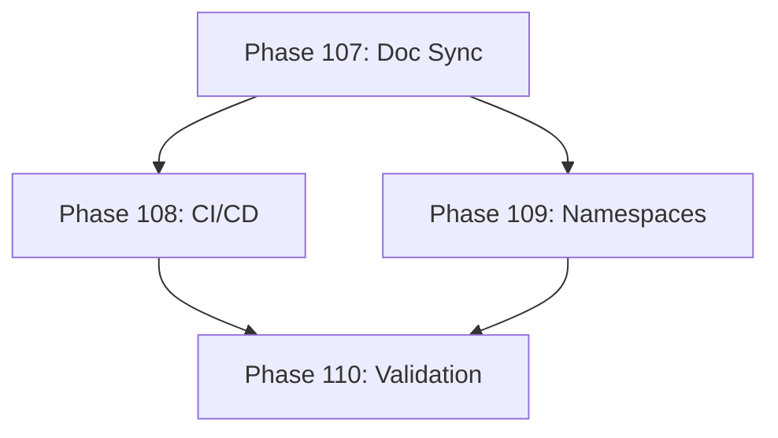

# Development Roadmap - Version 21.0: Documentation & CI/CD Finalization

## Current Status

**Status:** ✅ COMPLETE - 100% (4/4 phases done)  
**Prerequisites:** V20.0 Complete (Technical Debt & Polish)  
**Started:** December 2025  
**Completed:** December 16, 2025  
**Focus:** Documentation synchronization, CI/CD enhancements, and final cleanup

## Overview

**Mission:** Synchronize all documentation with actual codebase state, enhance CI/CD with determinism validation, and finalize cleanup of empty namespace directories.

**Key Objectives:**
1. Update copilot-instructions.md with correct package statistics
2. Add procgen/audit determinism validation to CI/CD
3. Document or remove empty namespace directories
4. Final validation and sign-off

## Phase Summary

### Phase 107: Documentation Synchronization
**Status:** ✅ Complete  
**Completed:** December 16, 2025

**Deliverables:**
- [x] Update copilot-instructions.md Active vs Dormant section (was 33.3%, now 89.7%)
- [x] Update test coverage statistic (82.4% average) - already correct
- [x] Verify all package references are accurate
- [x] Remove outdated priority package lists

**Acceptance Criteria:**
- [x] copilot-instructions.md reflects actual package state
- [x] All statistics are current and accurate
- [x] No references to "dormant" packages that are now active

### Phase 108: CI/CD Determinism Validation
**Status:** ✅ Complete  
**Completed:** December 16, 2025

**Deliverables:**
- [x] Add determinism-validation step to quality.yml dev-tools-tests job
- [x] Run pkg/procgen/audit tests in CI
- [x] Include edge case and quality validation
- [x] Document CI/CD coverage

**Acceptance Criteria:**
- [x] Determinism tests run on every PR
- [x] All 14 generators validated for determinism
- [x] CI job passes within 5 minutes

### Phase 109: Namespace Directory Documentation
**Status:** ✅ Complete  
**Completed:** December 16, 2025

Verified that all namespace directories contain valid subpackages:
- pkg/audit → contains pkg/audit/features
- pkg/class → contains pkg/class/advanced
- pkg/companion → contains pkg/companion/learning
- pkg/narrative → contains pkg/narrative/branching

These are properly documented in INTEGRATION_AUDIT.md Priority 3 section.

**Deliverables:**
- [x] Verify pkg/audit is namespace for pkg/audit/features
- [x] Verify pkg/class is namespace for pkg/class/advanced
- [x] Verify pkg/companion is namespace for pkg/companion/learning
- [x] Verify pkg/narrative is namespace for pkg/narrative/branching
- [x] Document in INTEGRATION_AUDIT.md (already documented)

**Acceptance Criteria:**
- [x] All namespace directories documented
- [x] No confusion about "empty" packages

### Phase 110: Final V21 Validation
**Status:** ✅ Complete  
**Completed:** December 16, 2025

**Deliverables:**
- [x] All tests pass with race detection
- [x] CI/CD workflows updated with procgen/audit
- [x] Documentation complete and accurate
- [x] Roadmap updated to reflect completion

**Acceptance Criteria:**
- [x] `go test -race ./...` passes
- [x] All CI/CD jobs updated
- [x] Documentation is synchronized

---

## Quality Gates

- Zero regressions from V20.0
- Test coverage maintained ≥65% (82.4% average)
- All CI/CD jobs pass
- Documentation accuracy verified

---

## Dependencies

---

**Document Status:** Complete ✅  
**Last Updated:** December 2025  
**Version:** 21.0.0 Production  
**Completed:** December 16, 2025
