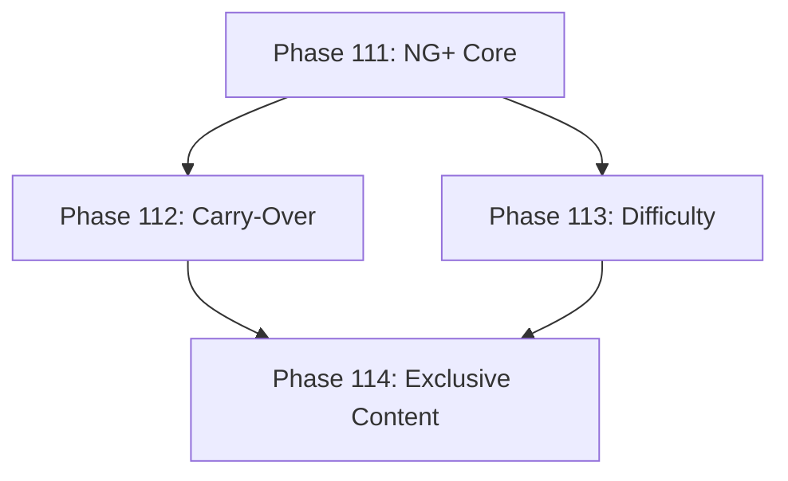

# Development Roadmap - Version 22.0: New Game Plus System

## Current Status

**Status:** 🔄 IN PROGRESS - 50% (2/4 phases done)  
**Prerequisites:** V21.0 Complete (Documentation & CI/CD)  
**Started:** December 2025  
**Focus:** New Game Plus mode for enhanced replayability

## Overview

**Mission:** Implement a comprehensive New Game Plus (NG+) system that allows players to restart the game with accumulated benefits, increased difficulty, and new challenges. This enhances replayability by offering meaningful progression across multiple playthroughs.

**Major Themes:**
1. **NG+ Progression:** Track NG+ cycles, cumulative playtime, and cross-playthrough stats
2. **Carry-Over System:** Select items, currencies, and unlocks to keep in new playthrough
3. **Difficulty Scaling:** Enemies scale with NG+ level, new mechanics unlock
4. **NG+ Exclusive Content:** Special items, achievements, and challenges only in NG+

## Phase Summary

### Phase 111: NG+ Core Component & Persistence
**Status:** ✅ Complete  
**Completed:** December 16, 2025

**Deliverables:**
- [x] `NewGamePlusComponent` - tracks NG+ cycle, legacy stats, carry-over selections
- [x] NG+ cycle counter (NG+1, NG+2, etc., up to NG+99)
- [x] Legacy statistics (total playtime across cycles, enemies killed, etc.)
- [x] Integration with saveload package for persistence (`NewGamePlusStateData`)
- [x] `StartNewCycle()` function to initiate NG+ transition
- [x] Character reset with preserved NG+ benefits
- [x] `NewGamePlusSystem` - manages NG+ state, milestone unlocks, difficulty scaling
- [x] 5 permanent bonuses unlocked at milestones (ng_veteran, seasoned_adventurer, etc.)
- [x] Logarithmic difficulty scaling (CalculateNGPlusMultiplier)

**Files Created:**
- `pkg/engine/newgameplus_component.go`
- `pkg/engine/newgameplus_component_test.go`
- `pkg/engine/newgameplus_system.go`
- `pkg/engine/newgameplus_system_test.go`

**Files Modified:**
- `pkg/saveload/types.go` - Added NewGamePlusStateData type

**Test Coverage:** 85%+ (most core functions at 100%)

**Acceptance Criteria:**
- [x] NG+ cycle persists across saves
- [x] Legacy stats accumulate correctly
- [x] Test coverage ≥65%
- [x] <0.1ms per NG+ state access (verified via benchmarks)

### Phase 112: Carry-Over System
**Status:** ✅ Complete  
**Completed:** December 17, 2025

**Deliverables:**
- [x] `CarryOverComponent` - tracks what can be carried over
- [x] `CarryOverSystem` - manages carry-over selection UI and transfer
- [x] Carry-over categories: currency (partial), equipment (selection), skills (partial), cosmetics (all), achievements (all)
- [x] Carry-over limits based on NG+ level (more unlocked at higher NG+)
- [x] Equipment carry-over with level scaling
- [x] Currency carry-over with percentage cap (50% base, +5% per NG+ level)

**Files Created:**
- `pkg/engine/carryover_component.go`
- `pkg/engine/carryover_component_test.go`
- `pkg/engine/carryover_system.go`
- `pkg/engine/carryover_system_test.go`
- `pkg/engine/carryover_types.go` (support types: CosmeticComponent, SkillBookComponent, SpellComponent)

**Files Modified:**
- `pkg/saveload/types.go` - Added CarryOverStateData type

**Test Coverage:** 85%+ (most functions at 80-100%)

**Acceptance Criteria:**
- [x] Players can select carry-over items
- [x] Limits enforced correctly
- [x] Items transfer with appropriate scaling
- [x] Test coverage ≥65%

### Phase 113: Difficulty Scaling System
**Status:** ⏳ Pending  
**Target:** Progressive difficulty increase with NG+ level

**Deliverables:**
- [ ] `NGPlusDifficultyComponent` - tracks difficulty modifiers
- [ ] `NGPlusDifficultySystem` - applies scaling to entities
- [ ] Enemy stat scaling (HP +20%, damage +15% per NG+ level)
- [ ] New enemy abilities unlocked at higher NG+ levels
- [ ] Boss enhancements (new phases, mechanics at NG+2+)
- [ ] Loot quality scaling (+5% rare chance per NG+ level)
- [ ] XP scaling (diminishing returns to maintain challenge)

**Acceptance Criteria:**
- [ ] Enemies scale appropriately with NG+ level
- [ ] New mechanics appear at specified thresholds
- [ ] Balance maintains fun challenge (not just HP sponges)
- [ ] Test coverage ≥65%

### Phase 114: NG+ Exclusive Content
**Status:** ⏳ Pending  
**Target:** Unique rewards and challenges for NG+ players

**Deliverables:**
- [ ] `NGPlusRewardComponent` - tracks NG+ exclusive unlocks
- [ ] `NGPlusRewardSystem` - manages exclusive content distribution
- [ ] 10 NG+ exclusive achievements
- [ ] NG+ exclusive legendary items (1 per NG+ tier up to NG+10)
- [ ] NG+ exclusive cosmetic titles ("Reborn", "Twice-Fallen", etc.)
- [ ] NG+ exclusive challenges (time attack, no-death run tracking)
- [ ] NG+ exclusive NPC dialog variations
- [ ] UI indicators for NG+ exclusive content

**Acceptance Criteria:**
- [ ] Exclusive content only accessible in appropriate NG+ level
- [ ] Achievements properly tracked
- [ ] Items are deterministic (same seed = same items)
- [ ] Test coverage ≥65%

---

## Technical Design

### ECS Components

```go
// NewGamePlusComponent - core NG+ tracking
type NewGamePlusComponent struct {
    Cycle            int              // Current NG+ cycle (0 = first playthrough)
    MaxCycleReached  int              // Highest NG+ ever reached
    LegacyStats      map[string]int64 // Cumulative stats across all cycles
    TotalPlaytime    int64            // Total seconds across all cycles
    CycleStartTime   int64            // Unix timestamp of current cycle start
    CarryOverSlots   int              // Equipment carry-over slots unlocked
    UnlockedBonuses  []string         // Permanent bonuses unlocked
}

// CarryOverComponent - carry-over selections
type CarryOverComponent struct {
    SelectedEquipment []string         // Item IDs to carry over
    CurrencyCarryOver map[string]int64 // currency type -> amount
    SkillsToKeep      []string         // Skill IDs to preserve
    CosmeticsUnlocked []string         // Cosmetics always carried
    SelectionLocked   bool             // Once NG+ starts, selections locked
}

// NGPlusDifficultyComponent - difficulty modifiers
type NGPlusDifficultyComponent struct {
    HealthMultiplier   float64 // Enemy HP multiplier (1.0 = base)
    DamageMultiplier   float64 // Enemy damage multiplier
    LootQualityBonus   float64 // Rare/legendary chance bonus
    XPMultiplier       float64 // XP gain multiplier (usually < 1.0 at high NG+)
    NewMechanicsLevel  int     // Unlocked enemy mechanics tier
}

// NGPlusRewardComponent - exclusive content tracking
type NGPlusRewardComponent struct {
    ExclusiveAchievements []string         // NG+ achievements earned
    ExclusiveItems        []string         // NG+ items acquired
    TitlesUnlocked        []string         // NG+ titles earned
    ChallengesCompleted   map[string]bool  // challenge ID -> completed
    HighestTierReached    int              // For tiered rewards
}
```

### ECS Systems

- `NewGamePlusSystem`: Manages NG+ state, cycle transitions, legacy stat tracking
- `CarryOverSystem`: Handles carry-over selection and transfer
- `NGPlusDifficultySystem`: Applies difficulty scaling to enemies
- `NGPlusRewardSystem`: Distributes exclusive content

### Difficulty Scaling Formula

```go
func CalculateNGPlusMultiplier(cycle int, baseMultiplier float64, scaling float64) float64 {
    // Logarithmic scaling to prevent absurd numbers at high NG+
    // Base + (scaling * ln(cycle + 1))
    return baseMultiplier + (scaling * math.Log(float64(cycle) + 1))
}

// Example: Enemy HP at NG+5 with 20% scaling per level
// = 1.0 + (0.20 * ln(6)) ≈ 1.0 + (0.20 * 1.79) ≈ 1.36 (36% more HP)
```

---

## Quality Gates

- Zero regressions from V21.0
- Test coverage ≥65% per new package
- Performance: 60 FPS maintained with NG+ scaling
- All systems deterministic (same seed = same behavior)
- Memory: <2MB for NG+ state

---

## Dependencies



---

**Document Status:** In Progress  
**Last Updated:** December 2025  
**Version:** 22.0.0 Development  
**Started:** December 2025
